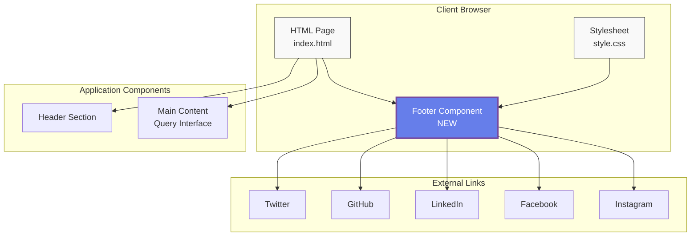
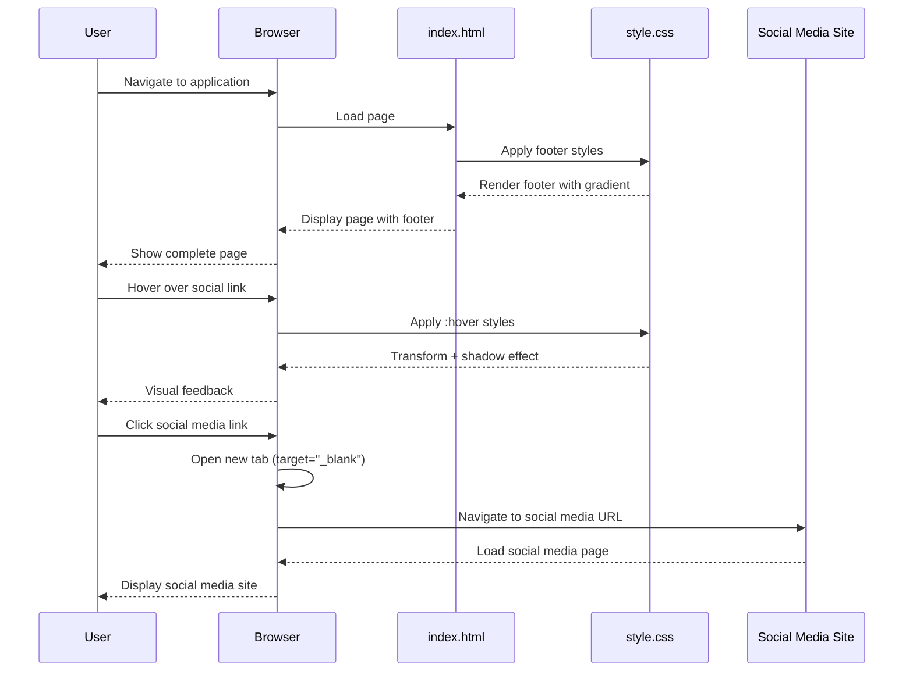

# Architecture Diagrams - Social Media Footer Feature

**ADW ID:** 61d49d73
**Feature:** Social Media Footer Links
**Date:** 2025-10-25

---

## Context Diagram

This diagram shows the overall system components and how the footer integrates with the application.



---

## Sequence Diagram

This diagram illustrates the user interaction flow with the footer component.



---

## Filesystem Structure

```
app/client/
├── index.html                    *** MODIFIED - Added footer HTML structure
├── src/
│   ├── style.css                 *** MODIFIED - Added footer styles and responsive design
│   └── main.ts
├── package.json
└── vite.config.ts

Key Changes:
- index.html: Added <footer> element with social media links before closing </div>
- style.css: Added .app-footer, .social-media-links, .social-link styles
- style.css: Added responsive @media queries for mobile footer layout
```

---

## Component Breakdown

### HTML Structure
```
<footer class="app-footer">
  └── <div class="footer-content">
      └── <div class="social-media-links">
          ├── <a class="social-link"> Twitter
          ├── <a class="social-link"> GitHub
          ├── <a class="social-link"> LinkedIn
          ├── <a class="social-link"> Facebook
          └── <a class="social-link"> Instagram
```

### CSS Classes
- `.app-footer` - Main footer container with gradient background
- `.footer-content` - Content wrapper with max-width constraint
- `.social-media-links` - Flexbox container for social links
- `.social-link` - Individual link styling with hover effects
- `.social-icon` - Emoji icon styling
- `.social-text` - Text label styling
