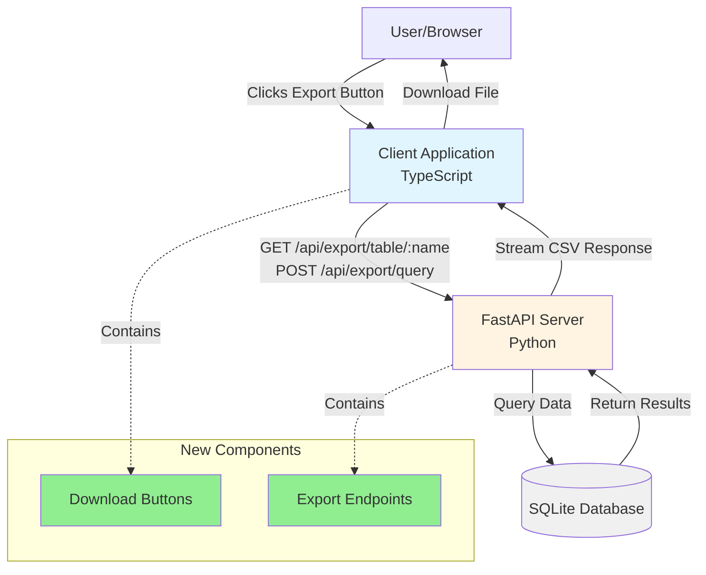
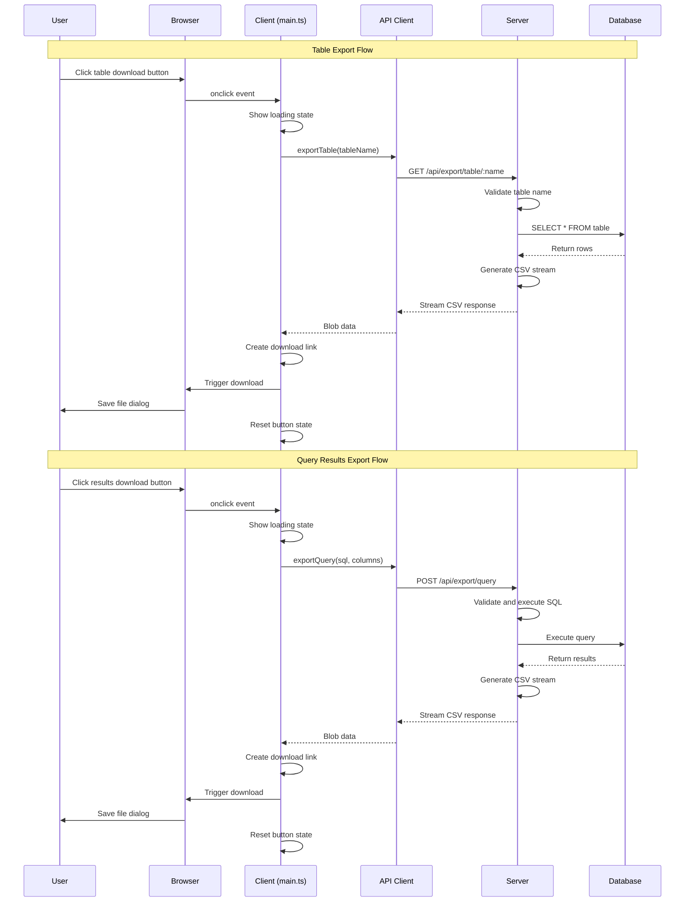

# Diagrams for Table Export Feature (d5edb40a)

## Context Diagram



## Sequence Diagram



## Filesystem Structure

```
app/
├── client/
│   ├── src/
│   │   ├── main.ts                 *** (Download button UI logic)
│   │   ├── api/
│   │   │   └── client.ts           *** (Export API methods)
│   │   └── style.css               *** (Download button styles)
│   └── index.html                  *** (Results header structure)
│
└── server/
    ├── server.py                    *** (Export endpoints)
    └── core/
        ├── data_models.py           *** (ExportQueryRequest model)
        ├── sql_security.py          (Security validation)
        └── sql_processor.py         (SQL utilities)

Key Changes:
- main.ts: Added download button creation and click handlers for both tables and query results
- style.css: New .download-button styles with modern button design
- client.ts: New exportTable() and exportQuery() API methods
- server.py: New generate_csv_response() helper and two export endpoints
- data_models.py: New ExportQueryRequest Pydantic model
- index.html: Added .results-header-buttons container for button layout
```

## Component Breakdown

```
Download Button Component (Tables):
├── button.download-button
│   ├── Attributes: data-table="table_name"
│   ├── Content: "📥 Export CSV"
│   ├── Position: In table header, left of ✕ button
│   └── States:
│       ├── Default: White background, blue border
│       ├── Hover: Blue background, white text
│       ├── Loading: Disabled, spinner displayed
│       └── Error: Reset to default, error shown in UI

Download Button Component (Query Results):
├── button.download-button
│   ├── Attributes: data-sql="...", data-columns="..."
│   ├── Content: "📥 Export CSV"
│   ├── Position: In .results-header-buttons, before Hide button
│   └── States: (Same as table button)

CSS Class Hierarchy:
.download-button
├── Base styles: padding, border, colors, transitions
├── :hover - Background/color inversion
├── :active - Subtle press effect
├── .loading - Opacity reduced, cursor disabled
└── .loading-spinner - Animated spinner for loading state
```
