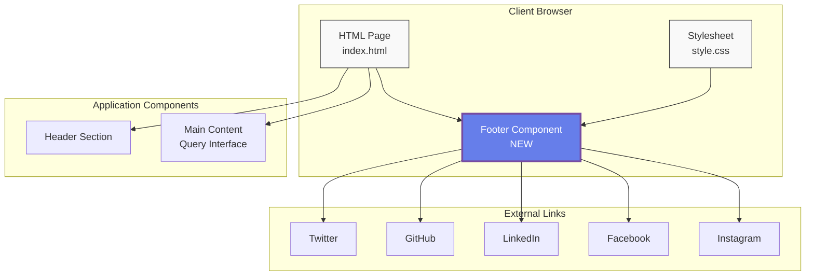
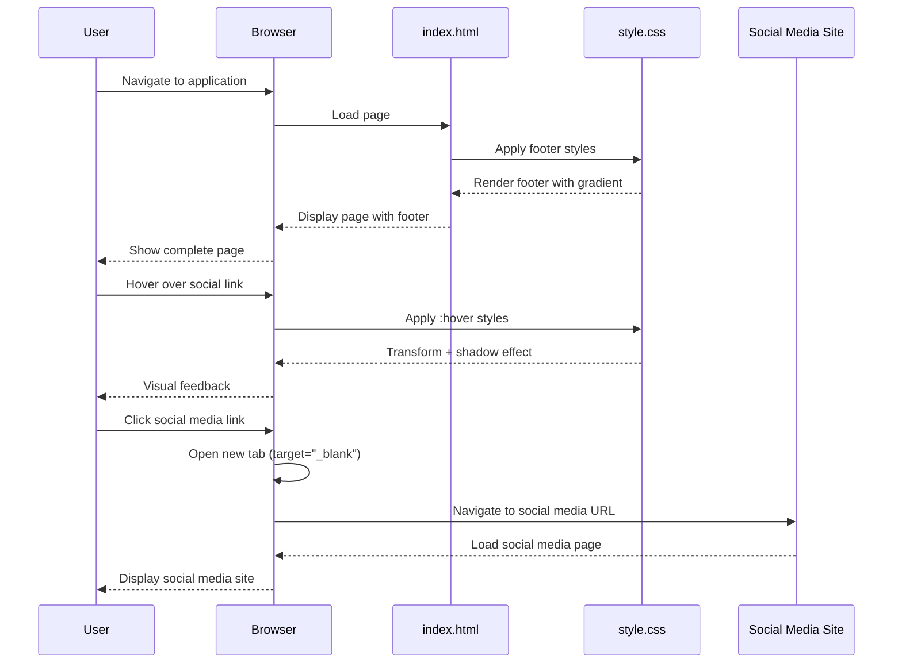

# Social Media Footer Links

**ADW ID:** 61d49d73
**Date:** 2025-10-25
**Specification:** specs/issue-20-adw-61d49d73-sdlc_planner-social-media-footer.md

## Overview

Added a responsive footer component to the application that displays links to five popular social media platforms (Twitter, GitHub, LinkedIn, Facebook, and Instagram). The footer features emoji icons, smooth hover effects with gradient styling consistent with the application's design language, and is fully accessible with proper ARIA labels and keyboard navigation support.

## Screenshots

### Footer Implementation


*The footer appears at the bottom of the page with five social media links using emoji icons*

### Interactive Hover Effect


*Hover effects include a subtle lift animation, increased brightness, and shadow for depth*

### Full Page Context


*The footer integrates seamlessly with the existing page layout without disrupting functionality*

## Architecture & Diagrams

### Context Diagram



### Sequence Diagram



### Filesystem Structure

```
app/client/
├── index.html                    *** MODIFIED - Added footer HTML structure
├── src/
│   ├── style.css                 *** MODIFIED - Added footer styles and responsive design
│   └── main.ts
├── package.json
└── vite.config.ts

Key Changes:
- index.html: Added <footer> element with social media links before closing </div>
- style.css: Added .app-footer, .social-media-links, .social-link styles
- style.css: Added responsive @media queries for mobile footer layout
```

## What Was Built

- **Semantic Footer Element**: Added a `<footer>` element with proper semantic HTML structure
- **Social Media Links**: Implemented five social media platform links (Twitter, GitHub, LinkedIn, Facebook, Instagram)
- **Emoji Icons**: Used emoji icons (🐦, 💻, 💼, 📘, 📷) for visual representation, consistent with the application's existing icon style
- **Gradient Styling**: Applied gradient background using existing CSS variables (--primary-color and --secondary-color)
- **Interactive Hover Effects**: Added smooth transitions with lift animation, shadow, and brightness increase
- **Responsive Design**: Implemented mobile-friendly layout that adapts to smaller viewports
- **Accessibility Features**: Included aria-labels, focus states, and touch-friendly link sizes (minimum 44x44px)
- **Security Attributes**: Added `target="_blank"` and `rel="noopener noreferrer"` to all external links

## Technical Implementation

### Files Modified

- `app/client/index.html` (lines 123-150): Added footer HTML structure with social media links container
  - Inserted before the closing `</div>` tags of the main container
  - Used semantic `<footer>` element with `.app-footer` class
  - Each link includes icon span and text span for flexible styling
  - All links include proper security and accessibility attributes

- `app/client/src/style.css` (lines 700-803): Added comprehensive footer styling
  - Base footer styles with gradient background
  - Social media links container with flexbox layout
  - Individual link styles with hover, active, and focus states
  - Responsive media queries for mobile viewports (max-width: 768px)

### Key Changes

- **Gradient Background**: Footer uses `linear-gradient(135deg, var(--primary-color), var(--secondary-color))` matching the application's purple gradient theme
- **Smooth Transitions**: All interactive states use `transition: all 0.3s ease` for consistent animation timing across the application
- **Hover Effect**: Links transform upward 2px (`translateY(-2px)`) and increase background opacity from 0.1 to 0.25 on hover
- **Responsive Behavior**: Footer content stacks and centers on mobile devices with adjusted padding and gap spacing
- **Touch Optimization**: Links meet minimum touch target size of 44x44px for mobile accessibility

## How to Use

### For End Users

1. Scroll to the bottom of any page in the application
2. The footer displays five social media platform links with emoji icons
3. Hover over any link to see the interactive effect (lift animation and glow)
4. Click any link to open the corresponding social media page in a new tab
5. Use keyboard navigation (Tab key) to navigate between links

### For Developers

**Updating Social Media URLs:**

Edit the `href` attributes in `app/client/index.html` (lines 127-146):

```html
<a href="https://twitter.com/yourproject" ...>
```

Replace placeholder URLs with actual project social media links.

**Adding New Social Media Platforms:**

1. Add a new `<a>` element within `.social-media-links` container
2. Follow the existing pattern:
   ```html
   <a href="URL" class="social-link" target="_blank" rel="noopener noreferrer" aria-label="Description">
     <span class="social-icon">🎵</span>
     <span class="social-text">TikTok</span>
   </a>
   ```
3. Choose an appropriate emoji icon and descriptive aria-label
4. No CSS changes required - existing styles will apply automatically

**Customizing Footer Styling:**

Modify the CSS classes in `app/client/src/style.css`:

- `.app-footer`: Background, spacing, and border
- `.social-link`: Link appearance and base styles
- `.social-link:hover`: Hover effect behavior

## Configuration

### Social Media Platform URLs

The following placeholder URLs are currently configured (update before production):

- **Twitter**: `https://twitter.com/yourproject`
- **GitHub**: `https://github.com/yourorganization/yourproject`
- **LinkedIn**: `https://linkedin.com/company/yourproject`
- **Facebook**: `https://facebook.com/yourproject`
- **Instagram**: `https://instagram.com/yourproject`

### Color Scheme

The footer uses existing CSS variables from `style.css`:

- `--primary-color: #667eea` (Purple)
- `--secondary-color: #764ba2` (Dark Purple)

### Responsive Breakpoint

Mobile layout activates at viewport width ≤ 768px with:
- Reduced padding (1.5rem vs 2rem)
- Reduced gap between links (1rem vs 1.5rem)
- Smaller link padding (0.6rem 1rem vs 0.75rem 1.25rem)

## Testing

### Manual Testing

1. Start the application: `./scripts/start.sh`
2. Navigate to http://localhost:5173
3. Scroll to the bottom of the page
4. Verify footer is visible with all five social media links
5. Test hover effects on each link
6. Test keyboard navigation using Tab key
7. Verify focus indicators are visible
8. Resize browser to mobile width (< 768px) and verify responsive layout

### Automated Testing

The feature includes E2E test coverage in `.claude/commands/e2e/test_social_media_footer.md` that validates:
- Footer visibility on page load
- Presence of all five social media links
- Correct href attributes for each link
- Hover effect functionality
- Responsive behavior on mobile viewports
- Accessibility attributes (aria-labels, target, rel)

### Accessibility Testing

- ✅ All links have descriptive aria-labels
- ✅ Color contrast meets WCAG AA standards (white text on purple gradient)
- ✅ Links are keyboard accessible (Tab navigation)
- ✅ Focus states are visible with 2px white outline
- ✅ Touch targets meet minimum 44x44px size
- ✅ Semantic HTML with `<footer>` element

## Notes

### Design Decisions

**Emoji Icons**: The implementation uses emoji icons (🐦, 💻, 💼, 📘, 📷) instead of icon fonts or SVGs for several reasons:
- Consistency with existing application design (profile button uses 👤 emoji)
- Zero external dependencies or HTTP requests
- Universal browser support
- Accessible to screen readers

**Gradient Background**: The footer uses the same gradient as the primary buttons to create visual consistency and reinforce the application's brand identity.

**No JavaScript Required**: The footer is purely HTML/CSS for maximum performance and reliability. It works even if JavaScript fails to load.

### Limitations

- **Placeholder URLs**: Social media links currently point to placeholder URLs that need to be updated with actual project links before production deployment
- **Static Content**: Links are hardcoded in HTML rather than configured via environment variables or configuration file
- **No Analytics**: Link clicks are not tracked; analytics integration could be added in the future

### Future Enhancements

- Add click tracking analytics to measure social media engagement
- Implement configurable URLs via environment variables or config file
- Add more social media platforms based on user feedback (YouTube, Discord, Medium)
- Consider adding footer navigation links (About, Privacy Policy, Terms of Service)
- Implement theme adaptation for potential future dark mode support
- Add animation on initial page load for footer entrance effect

### Performance Considerations

- Footer is part of initial HTML with no additional HTTP requests
- No external icon libraries reduce page weight
- CSS is minimal (~90 lines including responsive styles)
- No JavaScript initialization required
- Total performance impact: negligible (<1KB additional HTML/CSS)
