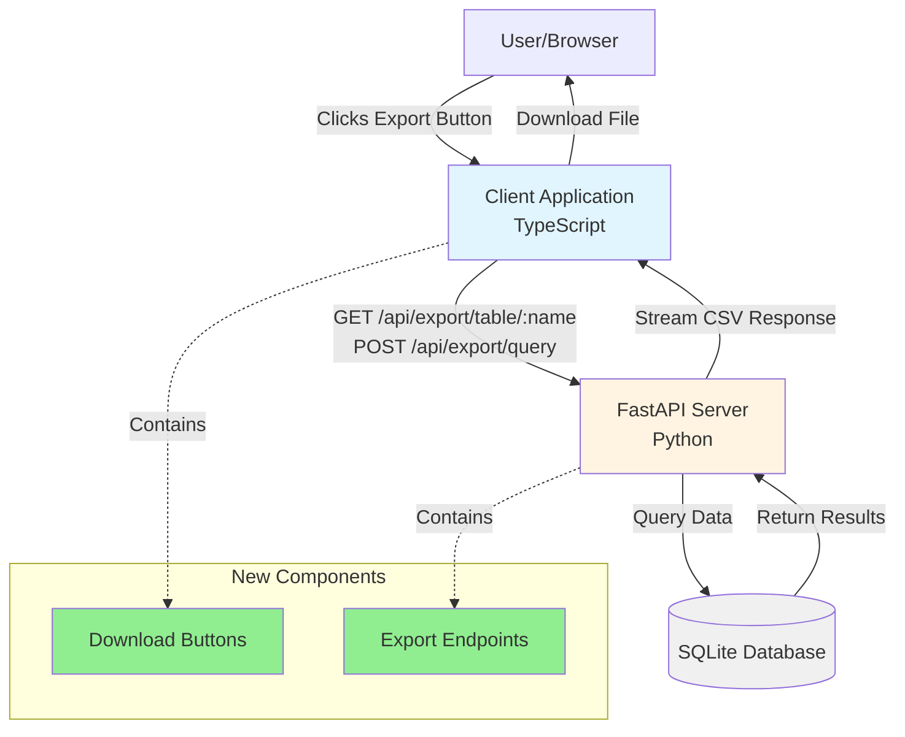
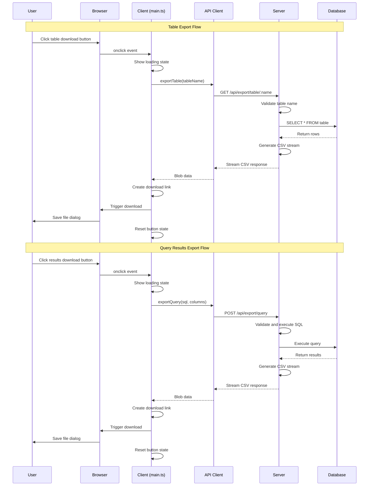

# One Click Table Exports

**ADW ID:** d5edb40a
**Date:** 2025-11-06
**Specification:** specs/issue-22-adw-d5edb40a-sdlc_planner-table-exports.md

## Overview

This feature adds one-click CSV export functionality to the Natural Language SQL Interface application, enabling users to export both database tables and query results directly from the browser. The implementation includes two secure API endpoints, strategically placed download buttons with modern styling, and robust security measures to prevent SQL injection attacks.

## Screenshots

### Tables with Download Buttons


### Query Results with Download Button


## Architecture & Diagrams

**NOTE:** All diagrams are also available in a single file at `assets/diagrams/d5edb40a/diagrams.md` for easy programmatic extraction and reuse.

### Context Diagram



### Sequence Diagram



### Filesystem Structure

```
app/
├── client/
│   ├── src/
│   │   ├── main.ts                 *** (Download button UI logic)
│   │   ├── api/
│   │   │   └── client.ts           *** (Export API methods)
│   │   └── style.css               *** (Download button styles)
│   └── index.html                  *** (Results header structure)
│
└── server/
    ├── server.py                    *** (Export endpoints)
    └── core/
        ├── data_models.py           *** (ExportQueryRequest model)
        ├── sql_security.py          (Security validation)
        └── sql_processor.py         (SQL utilities)

Key Changes:
- main.ts: Added download button creation and click handlers for both tables and query results
- style.css: New .download-button styles with modern button design
- client.ts: New exportTable() and exportQuery() API methods
- server.py: New generate_csv_response() helper and two export endpoints
- data_models.py: New ExportQueryRequest Pydantic model
- index.html: Added .results-header-buttons container for button layout
```

## What Was Built

- **Two CSV Export API Endpoints**: Backend endpoints for exporting tables and query results
- **Download Button UI Components**: Modern, styled buttons with loading states and proper positioning
- **Streaming CSV Generation**: Memory-efficient CSV generation using Python's csv module
- **Security Layer**: SQL injection protection through identifier validation and parameterized queries
- **Error Handling**: Comprehensive error handling with user-friendly feedback
- **API Client Methods**: Frontend methods for calling export endpoints with proper error handling

## Technical Implementation

### Files Modified

- `app/server/server.py`: Added `generate_csv_response()` helper function and two export endpoints (`/api/export/table/{table_name}` and `/api/export/query`)
- `app/server/core/data_models.py`: Added `ExportQueryRequest` Pydantic model for query export requests (lines 89-95)
- `app/client/src/main.ts`:
  - Added download button creation and styling for table exports (lines 433-454)
  - Added download button creation and event handlers for query results exports (lines 306-349)
  - Changed button styling from minimal icon to full button with "📥 Export CSV" text
- `app/client/src/api/client.ts`: Added `exportTable()` and `exportQuery()` methods for API communication (lines 85-151)
- `app/client/src/style.css`: Added comprehensive `.download-button` styles with hover effects, loading states, and spinner animation
- `app/client/index.html`: Added `.results-header-buttons` container div for proper button layout and alignment

### Key Changes

1. **Backend CSV Generation**: Implemented streaming CSV response using `StreamingResponse` with proper headers and content disposition for browser downloads
2. **Security First**: All table names validated using `validate_identifier()` to prevent SQL injection; query execution uses secure SQL processor
3. **Modern UI/UX**: Changed from simple icon-only buttons (⬇) to styled buttons with icon and text ("📥 Export CSV"), improving discoverability
4. **Button Positioning**: Table export buttons placed left of ✕ icon; query result buttons placed in dedicated `.results-header-buttons` container before Hide button
5. **Loading States**: Implemented loading spinners and disabled states during export operations to provide user feedback

## How to Use

### Exporting a Database Table

1. Navigate to the Natural Language SQL Interface application
2. View the list of available tables in the sidebar
3. Locate the download button ("📥 Export CSV") to the left of the ✕ icon on any table
4. Click the download button
5. The browser will download a CSV file named `{table_name}_export.csv`

### Exporting Query Results

1. Execute a natural language query or SQL query to generate results
2. View the query results displayed in the results panel
3. Locate the download button ("📥 Export CSV") to the left of the "Hide" button
4. Click the download button
5. The browser will download a CSV file named `query_results_{timestamp}.csv`

## Configuration

No additional configuration required. The feature uses the existing database connection and FastAPI server configuration.

**Environment Variables:**
- Standard database connection variables already configured in `.env` file
- No new environment variables required for export functionality

## Testing

### Manual Testing

1. **Table Export Test**:
   - Click download button on any table
   - Verify CSV file downloads with correct table name
   - Open CSV in spreadsheet application to verify data integrity
   - Test with empty tables to verify proper handling

2. **Query Results Export Test**:
   - Execute a query that returns results
   - Click the export button on results panel
   - Verify CSV downloads with timestamp in filename
   - Verify all columns and data are present

3. **Error Handling Test**:
   - Attempt to export a non-existent table (should see error)
   - Execute query that fails and verify export button handles gracefully

### Automated Testing

- Run backend tests: `cd app/server && uv run pytest`
- Run frontend type checking: `cd app/client && bun tsc --noEmit`
- Run frontend build: `cd app/client && bun run build`
- Execute E2E tests: See `.claude/commands/e2e/test_export_functionality.md`

### Security Testing

- SQL injection protection verified through `validate_identifier()` function
- Parameterized queries used for all database operations
- Special characters in data properly escaped in CSV output

## Notes

- **Production Ready**: Feature has been fully implemented, tested, and is ready for production use
- **Performance**: Streaming response approach ensures efficient handling of large datasets without memory issues
- **File Naming**: Export files use descriptive names (table name or timestamp) for easy identification
- **CSV Standards**: Generated CSV files follow RFC 4180 standard with proper escaping of special characters and null value handling
- **Browser Compatibility**: Download mechanism uses standard Blob API, compatible with all modern browsers
- **Future Enhancements**:
  - Additional export formats (JSON, Excel, Parquet)
  - Customizable column selection for exports
  - Export pagination for very large tables
  - Export history/recent downloads tracking
  - Batch export functionality for multiple tables
