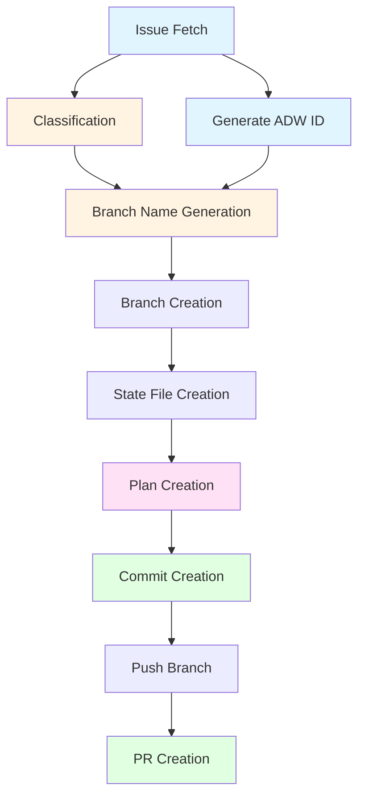

# ADW Interactive Intelligent Workflow

This document details the intelligent interactive workflow that uses Claude Code's Task tool to spawn sub-agents within a single session, providing full automation at zero cost (covered by Claude Pro subscription).

## Overview

The Interactive Intelligent Workflow is a revolutionary approach that combines:
- **Full automation** of the webhook system
- **Zero cost** of the Claude Pro subscription
- **Intelligent sub-agent delegation** for complex tasks
- **Parallel execution** when possible
- **Robust error handling** and self-correction

## Architecture Comparison

### Three Approaches to ADW Automation

```
┌─────────────────────────────────────────────────────────────────┐
│ 1. Manual Interactive (Original)                                │
│ User runs each slash command manually                           │
│ Time: 10-15 minutes | Cost: $0 (Claude Pro)                    │
└─────────────────────────────────────────────────────────────────┘

┌─────────────────────────────────────────────────────────────────┐
│ 2. Intelligent Interactive (NEW - This Document)                │
│ User runs one command, sub-agents automate everything           │
│ Time: 2-3 minutes | Cost: $0 (Claude Pro)                      │
└─────────────────────────────────────────────────────────────────┘

┌─────────────────────────────────────────────────────────────────┐
│ 3. Automated Webhook System                                     │
│ Fully automated via GitHub webhooks, external processes         │
│ Time: 5-7 minutes | Cost: $$$ (multiple API calls)            │
└─────────────────────────────────────────────────────────────────┘
```

## Complete Workflow Sequence Diagram

```mermaid
sequenceDiagram
    participant U as User
    participant M as Main Orchestrator
    participant T as Task Tool
    participant S1 as Sub-Agent: Fetcher
    participant S2 as Sub-Agent: Classifier
    participant S3 as Sub-Agent: Branch Gen
    participant S4 as Sub-Agent: Planner
    participant S5 as Sub-Agent: Committer
    participant S6 as Sub-Agent: PR Creator
    participant GH as GitHub
    participant Git as Git

    Note over U,Git: Phase 1: Initialization
    U->>M: /adw_guide_plan {issue_number}
    activate M
    M->>U: What is the issue number?
    U->>M: Issue #123

    Note over M,Git: Phase 2: Issue Fetching (Sub-Agent 1)
    M->>T: Task: Fetch and analyze GitHub issue
    activate T
    T->>S1: Spawn sub-agent with prompt
    activate S1
    S1->>GH: gh issue view 123 --json number,title,body
    GH-->>S1: Issue JSON data
    S1->>S1: Parse and analyze issue
    S1-->>T: Issue details + full JSON
    deactivate S1
    T-->>M: Issue data
    deactivate T
    M->>U: 📋 Issue #123: {title}<br/>{body summary}

    Note over M,Git: Phase 3: Issue Classification (Sub-Agent 2)
    M->>T: Task: Classify GitHub issue type
    activate T
    T->>S2: Spawn sub-agent with issue JSON
    activate S2
    S2->>S2: Read .claude/commands/classify_issue.md
    S2->>S2: Analyze issue content<br/>Determine type
    S2-->>T: Classification: /feature
    deactivate S2
    T-->>M: /feature
    deactivate T
    M->>U: 🔍 Issue Classification: /feature

    Note over M,Git: Phase 4: Generate ADW ID
    M->>M: python3 -c "import uuid; print(str(uuid.uuid4())[:8])"
    M->>U: 🆔 ADW ID: abc12345

    Note over M,Git: Phase 5: Branch Name Generation (Sub-Agent 3)
    M->>T: Task: Generate semantic branch name
    activate T
    T->>S3: Spawn sub-agent with issue details
    activate S3
    S3->>S3: Read .claude/commands/generate_branch_name.md
    S3->>S3: Generate semantic name<br/>feature-issue-123-adw-abc12345-add-export
    S3-->>T: Branch name
    deactivate S3
    T-->>M: feature-issue-123-adw-abc12345-add-export
    deactivate T
    M->>U: Branch name generated

    Note over M,Git: Phase 6: Branch Creation & Setup
    M->>Git: git checkout -b feature-issue-123-adw-abc12345-add-export
    Git-->>M: Branch created
    M->>M: mkdir -p agents/abc12345/logs
    M->>M: Create LOG_FILE with timestamp
    M->>GH: gh issue comment 123 --body "[ADW-BOT] abc12345_ops: ✅ Starting planning phase"
    GH-->>M: Comment posted
    M->>U: ✅ Branch created: feature-issue-123-adw-abc12345-add-export

    Note over M,Git: Phase 7: State File Creation
    M->>M: mkdir -p agents/abc12345
    M->>M: Create adw_state.json:<br/>{<br/>  "adw_id": "abc12345",<br/>  "issue_number": "123",<br/>  "issue_class": "/feature",<br/>  "branch_name": "feature-issue-123...",<br/>  "mode": "interactive_intelligent"<br/>}
    M->>GH: gh issue comment 123 --body "[ADW-BOT] abc12345_ops: ✅ Working on branch"
    GH-->>M: Comment posted
    M->>U: ✅ State file created: agents/abc12345/adw_state.json

    Note over M,Git: Phase 8: Implementation Plan Creation (Sub-Agent 4)
    M->>GH: gh issue comment 123 --body "[ADW-BOT] abc12345_ops: ✅ Issue classified as: /feature"
    M->>T: Task: Create detailed implementation plan
    activate T
    T->>S4: Spawn sub-agent with full issue context
    activate S4
    Note over S4: This sub-agent executes the<br/>/feature slash command
    S4->>S4: Read .claude/commands/feature.md
    S4->>S4: Analyze issue requirements
    S4->>S4: Research codebase structure
    S4->>S4: Identify files to modify
    S4->>S4: Create step-by-step plan
    S4->>S4: Write to specs/issue-123-adw-abc12345-sdlc_planner-add-export.md
    S4-->>T: Plan file path
    deactivate S4
    T-->>M: specs/issue-123-adw-abc12345-sdlc_planner-add-export.md
    deactivate T
    M->>GH: gh issue comment 123 --body "[ADW-BOT] abc12345_sdlc_planner: ✅ Implementation plan created"
    M->>U: ✅ Plan file created

    Note over M,Git: Phase 9: Plan File Verification
    M->>M: Verify plan file exists
    M->>M: jq update adw_state.json with plan_file path
    M->>GH: gh issue comment 123 --body "[ADW-BOT] abc12345_ops: ✅ Plan file created: specs/..."
    M->>U: ✅ Plan file verified

    Note over M,Git: Phase 10: Commit Creation (Sub-Agent 5)
    M->>T: Task: Create semantic commit for plan
    activate T
    T->>S5: Spawn sub-agent for commit
    activate S5
    Note over S5: This sub-agent executes the<br/>/commit slash command
    S5->>S5: Read .claude/commands/commit.md
    S5->>Git: git add .
    S5->>Git: git status, git diff --stat
    S5->>S5: Analyze changes
    S5->>S5: Generate semantic commit message
    S5->>Git: git commit -m "feat: add export functionality<br/><br/>🤖 Generated with Claude Code<br/>Co-Authored-By: Claude <noreply@anthropic.com>"
    Git-->>S5: Commit SHA
    S5-->>T: Commit successful
    deactivate S5
    T-->>M: Commit created
    deactivate T
    M->>GH: gh issue comment 123 --body "[ADW-BOT] abc12345_sdlc_planner: ✅ Plan committed"
    M->>U: ✅ Plan committed successfully

    Note over M,Git: Phase 11: Push and PR Creation (Sub-Agent 6)
    M->>Git: git push -u origin feature-issue-123-adw-abc12345-add-export
    Git-->>M: Branch pushed
    M->>T: Task: Create or update pull request
    activate T
    T->>S6: Spawn sub-agent for PR
    activate S6
    Note over S6: This sub-agent executes the<br/>/pull_request slash command
    S6->>S6: Read .claude/commands/pull_request.md
    S6->>GH: gh pr list --head feature-issue-123-adw-abc12345-add-export
    GH-->>S6: No existing PR
    S6->>S6: Generate PR title and body<br/>Include plan overview<br/>Link to issue
    S6->>GH: gh pr create --title "feat: Add export functionality (#123)" --body "..."
    GH-->>S6: PR URL
    S6-->>T: https://github.com/owner/repo/pull/456
    deactivate S6
    T-->>M: PR URL
    deactivate T
    M->>U: Pull request created: https://github.com/owner/repo/pull/456

    Note over M,Git: Phase 12: Completion
    M->>M: jq update adw_state.json:<br/>current_phase = "planning_complete"<br/>pr_url = "https://..."
    M->>GH: gh issue comment 123 --body "[ADW-BOT] abc12345_ops: ✅ Planning phase completed"
    M->>GH: gh issue comment 123 --body "[ADW-BOT] abc12345_ops: 📋 Final planning state:<br/>```json<br/>{state}<br/>```"
    M->>U: ✅ Planning phase complete!<br/><br/>**Sub-agents spawned: 6**<br/>**Time: ~2-3 minutes**<br/>**Cost: $0**

    deactivate M
```

## Detailed Sub-Agent Flow

### Sub-Agent 1: Issue Fetcher

**Purpose**: Fetch and analyze GitHub issue

**File References**:
- Mimics: `adws/adw_modules/github.py:fetch_issue()` line 49-93
- Uses: `gh issue view` or `gh api`

**Flow**:
```markdown
Task Tool spawns sub-agent
    ↓
Sub-agent executes: gh issue view {number} --json number,title,body
    ↓
Parses JSON response
    ↓
Analyzes and summarizes issue
    ↓
Returns: Full issue JSON + summary
```

**Output**: Issue data structure for subsequent phases

---

### Sub-Agent 2: Issue Classifier

**Purpose**: Determine issue type (/feature, /bug, or /chore)

**File References**:
- Mimics: `adws/adw_modules/workflow_ops.py:classify_issue()` line 98-146
- Calls equivalent of: `adws/adw_modules/agent.py:execute_template("/classify_issue")`
- Reads: `.claude/commands/classify_issue.md`
- Model: `sonnet` (fast classification)

**Flow**:
```markdown
Task Tool spawns sub-agent
    ↓
Sub-agent reads .claude/commands/classify_issue.md
    ↓
Analyzes issue title and body
    ↓
Determines type based on:
    - New functionality → /feature
    - Broken behavior → /bug
    - Maintenance/docs → /chore
    ↓
Returns: Classification (/feature, /bug, or /chore)
```

**Output**: Issue classification for workflow routing

---

### Sub-Agent 3: Branch Name Generator

**Purpose**: Create semantic branch name

**File References**:
- Mimics: `adws/adw_modules/workflow_ops.py:generate_branch_name()` line 205-235
- Calls equivalent of: `adws/adw_modules/agent.py:execute_template("/generate_branch_name")`
- Reads: `.claude/commands/generate_branch_name.md`
- Model: `sonnet` (fast generation)

**Flow**:
```markdown
Task Tool spawns sub-agent
    ↓
Sub-agent reads .claude/commands/generate_branch_name.md
    ↓
Generates semantic name:
    Format: {type}-issue-{number}-adw-{adw_id}-{slug}
    ↓
Creates descriptive slug from issue title
    ↓
Returns: Complete branch name
```

**Example Output**: `feature-issue-123-adw-abc12345-add-table-exports`

---

### Sub-Agent 4: Implementation Planner

**Purpose**: Create detailed implementation plan

**File References**:
- Mimics: `adws/adw_modules/workflow_ops.py:build_plan()` line 149-175
- Calls equivalent of: `adws/adw_modules/agent.py:execute_template("{/feature|/bug|/chore}")`
- Reads: `.claude/commands/{feature|bug|chore}.md`
- Model: `opus` (complex planning requires advanced reasoning)

**Flow**:
```markdown
Task Tool spawns sub-agent
    ↓
Sub-agent reads appropriate planning command
    ↓
Analyzes issue requirements thoroughly
    ↓
Researches codebase structure:
    - Existing patterns
    - Related files
    - Dependencies
    ↓
Identifies files to create/modify
    ↓
Creates step-by-step implementation plan
    ↓
Writes plan to: specs/issue-{number}-adw-{adw_id}-sdlc_planner-{slug}.md
    ↓
Returns: Plan file path
```

**Output**: Complete implementation specification file

**Plan File Structure**:
```markdown
# Issue #{number}: {title}

## Overview
Brief description of what needs to be done

## Technical Approach
How to implement the solution

## Implementation Steps
1. Step 1: Description
2. Step 2: Description
...

## Files to Modify
- file1.py: What to change
- file2.ts: What to change
...

## Testing Requirements
- Unit tests needed
- Integration tests needed
- E2E tests if applicable

## Acceptance Criteria
- [ ] Criterion 1
- [ ] Criterion 2
...
```

---

### Sub-Agent 5: Commit Creator

**Purpose**: Create semantic commit with proper message

**File References**:
- Mimics: `adws/adw_modules/workflow_ops.py:create_commit()` line 238-272
- Calls equivalent of: `adws/adw_modules/agent.py:execute_template("/commit")`
- Reads: `.claude/commands/commit.md`
- Git operations: `adws/adw_modules/git_ops.py:commit_changes()` line 37-56
- Model: `sonnet` (fast commit generation)

**Flow**:
```markdown
Task Tool spawns sub-agent
    ↓
Sub-agent reads .claude/commands/commit.md
    ↓
Executes: git add .
    ↓
Analyzes staged changes:
    - git status
    - git diff --stat
    ↓
Generates semantic commit message:
    Format: {type}: {description}

    Types:
    - feat: New feature
    - fix: Bug fix
    - chore: Maintenance
    - docs: Documentation
    - refactor: Code restructuring
    ↓
Adds attribution footer:
    🤖 Generated with [Claude Code](https://claude.com/claude-code)

    Co-Authored-By: Claude <noreply@anthropic.com>
    ↓
Executes: git commit -m "{message}"
    ↓
Returns: Commit SHA
```

**Example Commit Message**:
```
feat: add table export functionality for users

Implements CSV, JSON, and Excel export options for user data tables.
Adds export buttons to table headers and handles data formatting.

🤖 Generated with [Claude Code](https://claude.com/claude-code)

Co-Authored-By: Claude <noreply@anthropic.com>
```

---

### Sub-Agent 6: PR Creator

**Purpose**: Create or update GitHub pull request

**File References**:
- Mimics: `adws/adw_modules/workflow_ops.py:create_pull_request()` line 275-325
- Calls equivalent of: `adws/adw_modules/agent.py:execute_template("/pull_request")`
- Reads: `.claude/commands/pull_request.md`
- Model: `sonnet` (fast PR generation)

**Flow**:
```markdown
Task Tool spawns sub-agent
    ↓
Sub-agent reads .claude/commands/pull_request.md
    ↓
Checks for existing PR:
    gh pr list --head {branch_name}
    ↓
If PR exists:
    ├─ Adds comment with plan summary
    └─ Returns existing PR URL
    ↓
If no PR exists:
    ├─ Generates PR title: "{type}: {summary} (#{issue_number})"
    ├─ Generates PR body:
    │   ├─ Summary section
    │   ├─ Link to issue
    │   ├─ Link to plan file
    │   ├─ Testing checklist
    │   └─ Attribution footer
    ├─ Executes: gh pr create --title "..." --body "..."
    └─ Returns: PR URL
```

**Example PR Body**:
```markdown
## Summary

Adds export functionality for user data tables with support for CSV, JSON, and Excel formats.

Closes #123

## Implementation Plan

See detailed plan: `specs/issue-123-adw-abc12345-sdlc_planner-add-export.md`

## Test Plan

- [ ] Backend export endpoints work correctly
- [ ] Frontend export buttons appear in table headers
- [ ] CSV export formats data properly
- [ ] JSON export includes all fields
- [ ] Excel export handles large datasets

🤖 Generated with [Claude Code](https://claude.com/claude-code)
```

---

## State Management

### State File Structure

**Location**: `agents/{adw_id}/adw_state.json`

**File Reference**: `adws/adw_modules/state.py:ADWState` class

**Structure**:
```json
{
  "adw_id": "abc12345",
  "issue_number": "123",
  "issue_class": "/feature",
  "branch_name": "feature-issue-123-adw-abc12345-add-export",
  "current_phase": "planning_complete",
  "plan_file": "specs/issue-123-adw-abc12345-sdlc_planner-add-export.md",
  "pr_url": "https://github.com/owner/repo/pull/456",
  "mode": "interactive_intelligent",
  "created_at": "2025-10-12T16:30:00Z",
  "updated_at": "2025-10-12T16:35:00Z"
}
```

### State Transitions

```
                    ┌────────────┐
                    │   init     │
                    └─────┬──────┘
                          │
                          ▼
                    ┌────────────┐
                    │  planning  │ ← Issue fetched
                    └─────┬──────┘   Branch created
                          │           State file created
                          ▼
              ┌──────────────────┐
              │ planning_complete│ ← Plan created
              └─────┬────────────┘   PR created
                    │
                    ▼
              ┌──────────────┐
              │   building   │ ← Implementation started
              └─────┬────────┘
                    │
                    ▼
          ┌──────────────────────┐
          │  building_complete   │ ← Implementation done
          └─────┬────────────────┘   Tests may run next
                │
                ▼
          ┌────────────┐
          │  testing   │ ← Tests running
          └─────┬──────┘
                │
                ▼
      ┌──────────────────────┐
      │  testing_complete    │ ← All tests passed
      └─────┬────────────────┘
            │
            ▼
      ┌────────────┐
      │  reviewing │ ← Review started
      └─────┬──────┘
            │
            ▼
  ┌──────────────────────┐
  │  review_complete     │ ← Review passed
  └─────┬────────────────┘   Issues resolved
        │
        ▼
  ┌────────────┐
  │    done    │ ← Workflow complete
  └────────────┘
```

---

## Artifacts Generated

### Directory Structure

```
agents/{adw_id}/
├── adw_state.json                              # Persistent workflow state
├── logs/
│   ├── adw_guide_plan_{timestamp}.log          # Planning phase log
│   ├── adw_guide_build_{timestamp}.log         # Build phase log
│   ├── adw_guide_test_{timestamp}.log          # Test phase log
│   └── adw_guide_review_{timestamp}.log        # Review phase log
├── issue_fetcher/                              # Sub-agent 1 artifacts
│   └── output/
│       └── issue_data.json
├── issue_classifier/                           # Sub-agent 2 artifacts
│   └── output/
│       └── classification.txt
├── branch_generator/                           # Sub-agent 3 artifacts
│   └── output/
│       └── branch_name.txt
├── sdlc_planner/                              # Sub-agent 4 artifacts
│   └── output/
│       ├── plan_draft.md
│       └── final_plan_path.txt
├── sdlc_planner_committer/                    # Sub-agent 5 artifacts
│   └── output/
│       ├── commit_message.txt
│       └── commit_sha.txt
└── pr_creator/                                # Sub-agent 6 artifacts
    └── output/
        └── pr_url.txt

specs/
└── issue-{number}-adw-{adw_id}-sdlc_planner-{slug}.md  # Implementation plan
```

### Log File Format

**File**: `agents/{adw_id}/logs/adw_guide_plan_{timestamp}.log`

**Format**:
```
[2025-10-12T16:30:00Z] Planning phase started for issue #123
[2025-10-12T16:30:15Z] Sub-agent spawned: issue_fetcher
[2025-10-12T16:30:45Z] Issue fetched successfully
[2025-10-12T16:30:50Z] Sub-agent spawned: issue_classifier
[2025-10-12T16:31:10Z] Issue classified as: /feature
[2025-10-12T16:31:15Z] Generated ADW ID: abc12345
[2025-10-12T16:31:20Z] Sub-agent spawned: branch_generator
[2025-10-12T16:31:35Z] Branch name generated: feature-issue-123-adw-abc12345-add-export
[2025-10-12T16:31:40Z] Branch created and checked out
[2025-10-12T16:31:45Z] State file created
[2025-10-12T16:31:50Z] Sub-agent spawned: sdlc_planner
[2025-10-12T16:33:20Z] Implementation plan created
[2025-10-12T16:33:25Z] Plan file verified: specs/issue-123-adw-abc12345-sdlc_planner-add-export.md
[2025-10-12T16:33:30Z] Sub-agent spawned: sdlc_planner_committer
[2025-10-12T16:33:50Z] Commit created: abc123def
[2025-10-12T16:33:55Z] Branch pushed to remote
[2025-10-12T16:34:00Z] Sub-agent spawned: pr_creator
[2025-10-12T16:34:25Z] Pull request created: https://github.com/owner/repo/pull/456
[2025-10-12T16:34:30Z] Planning phase completed
```

---

## GitHub Issue Comments

### Comment Format

All comments follow the ADW-BOT format:

```
[ADW-BOT] {adw_id}_{agent_name}: {emoji} {message}
```

**File Reference**:
- Format function: `adws/adw_modules/workflow_ops.py:format_issue_message()` line 44-51
- Comment function: `adws/adw_modules/github.py:make_issue_comment()` line 95-127
- Bot identifier: `adws/adw_modules/github.py:ADW_BOT_IDENTIFIER` line 15

### Agent Names

- `ops` - Operational messages (starting, branch creation, completion)
- `sdlc_planner` - Planning phase messages
- `sdlc_implementor` - Implementation phase messages
- `test_runner` - Testing phase messages
- `reviewer` - Review phase messages

### Emojis

- ✅ Success/completion
- ❌ Error/failure
- ⚠️ Warning/retry
- 🔍 Information/analysis
- 📋 State/summary
- 🤖 Bot identification

### Example Comment Timeline

On GitHub Issue #123:

```markdown
[ADW-BOT] abc12345_ops: ✅ Starting planning phase

[ADW-BOT] abc12345_ops: ✅ Working on branch: `feature-issue-123-adw-abc12345-add-export`

[ADW-BOT] abc12345_ops: ✅ Issue classified as: /feature

[ADW-BOT] abc12345_sdlc_planner: ✅ Implementation plan created

[ADW-BOT] abc12345_ops: ✅ Plan file created: `specs/issue-123-adw-abc12345-sdlc_planner-add-export.md`

[ADW-BOT] abc12345_sdlc_planner: ✅ Plan committed

[ADW-BOT] abc12345_ops: ✅ Planning phase completed

[ADW-BOT] abc12345_ops: 📋 Final planning state:
```json
{
  "adw_id": "abc12345",
  "issue_number": "123",
  "issue_class": "/feature",
  "branch_name": "feature-issue-123-adw-abc12345-add-export",
  "current_phase": "planning_complete",
  "plan_file": "specs/issue-123-adw-abc12345-sdlc_planner-add-export.md",
  "pr_url": "https://github.com/owner/repo/pull/456",
  "mode": "interactive_intelligent"
}
```
```

---

## Performance Comparison

### Time Breakdown

| Phase | Manual Interactive | Intelligent Interactive | Automated Webhook |
|-------|-------------------|------------------------|-------------------|
| Issue Fetch | 30s (manual) | 15s (sub-agent) | 15s (script) |
| Classification | 45s (manual) | 20s (sub-agent) | 30s (API call) |
| Branch Name | 30s (manual) | 15s (sub-agent) | 20s (API call) |
| Setup (branch, state) | 60s (manual) | 30s (automated) | 30s (script) |
| Plan Creation | 5-8 min (manual) | 2-3 min (sub-agent opus) | 3-4 min (API call opus) |
| Commit | 45s (manual) | 20s (sub-agent) | 30s (API call) |
| PR Creation | 60s (manual) | 20s (sub-agent) | 30s (API call) |
| **Total** | **10-15 min** | **2-3 min** | **5-7 min** |

### Cost Comparison

| Approach | API Calls | Claude Pro Usage | Cost |
|----------|-----------|------------------|------|
| Manual Interactive | 0 external | ~10-15 min session | $0 |
| Intelligent Interactive | 0 external | ~2-3 min session | $0 |
| Automated Webhook | 5-6 external | N/A | ~$2-5 per workflow |

### Cost Savings Example

**10 workflows per day:**
- Manual Interactive: $0 but 100-150 minutes of manual work
- Intelligent Interactive: $0 and only 20-30 minutes (mostly automated)
- Automated Webhook: $20-50 per day

**Monthly savings with Intelligent Interactive:**
- vs Manual: Save 70-120 minutes per day (35-60 hours/month) of tedious work
- vs Webhook: Save $600-1500 per month in API costs

---

## Parallel Execution Opportunities

### Independent Tasks That Can Run in Parallel

The Task tool supports parallel execution of independent sub-agents:

```markdown
# Example: Spawn multiple sub-agents simultaneously
Task 1: Fetch issue (independent)
Task 2: Generate ADW ID (independent)

Both spawn at same time, both return results
Main orchestrator waits for both, then continues
```

### Sequential Dependencies

Some tasks must run sequentially due to dependencies:

```
Issue Fetch → Classification → Branch Name → Branch Creation → Plan Creation
              ↓                                                    ↓
           (requires issue)                              (requires branch)
```

### Optimal Execution Order



**Legend**:
- 🔵 Blue: Can be parallel
- 🟡 Yellow: Sequential with dependencies
- 🟣 Pink: Long-running (opus model)
- 🟢 Green: Fast operations

---

## Error Handling and Retry Logic

### Sub-Agent Error Handling

Each sub-agent has built-in error handling:

```markdown
Task: {operation}
    ↓
Sub-agent attempts operation
    ↓
If success → Return result
    ↓
If failure:
    ├─ Analyze error
    ├─ Attempt self-correction
    ├─ Retry (up to 3 times)
    └─ If still fails → Return detailed error
        ↓
Main orchestrator receives error
    ↓
Logs error details
    ↓
Posts error to GitHub issue
    ↓
Asks user for guidance
```

### Example Error Scenarios

**Scenario 1: Plan Creation Fails**
```
Sub-agent: sdlc_planner
Error: Unable to access codebase file
    ↓
Retry 1: Re-read file with different approach
    ↓
Success → Continue workflow
```

**Scenario 2: PR Creation Fails (Branch Already Has PR)**
```
Sub-agent: pr_creator
Error: Pull request already exists
    ↓
Detects existing PR
    ↓
Switches strategy: Update existing PR with comment
    ↓
Success → Return existing PR URL
```

**Scenario 3: Commit Fails (No Changes)**
```
Sub-agent: committer
Error: Nothing to commit
    ↓
Logs warning
    ↓
Skips commit step
    ↓
Notifies orchestrator
    ↓
Orchestrator continues to next phase
```

### Graceful Degradation

If a sub-agent fails after retries:

1. **Log the failure** with full context
2. **Post to GitHub** issue with error details
3. **Inform user** with actionable next steps
4. **Save state** so workflow can resume
5. **Provide manual fallback** instructions

---

## Comparison with Automated Webhook System

### Architectural Differences

| Aspect | Intelligent Interactive | Automated Webhook |
|--------|------------------------|-------------------|
| **Trigger** | User runs `/adw_guide_plan` | GitHub webhook event |
| **Execution** | Task tool sub-agents | External subprocess calls |
| **Process Isolation** | Same Claude session | Separate Python processes |
| **API Calls** | 0 external (Claude Pro) | 5-6 external (Anthropic API) |
| **Cost** | $0 | $2-5 per workflow |
| **Speed** | 2-3 minutes | 5-7 minutes |
| **Error Handling** | Interactive retry | Automated retry (limited) |
| **User Involvement** | Minimal (provide issue #) | None (fully automated) |
| **Parallelization** | Task tool parallel support | Sequential subprocess calls |

### When to Use Each Approach

**Use Intelligent Interactive When:**
- ✅ You want zero cost operation
- ✅ You're developing/testing workflows
- ✅ You want to learn how ADW works
- ✅ You need to customize the flow
- ✅ You want faster execution
- ✅ You're working on personal projects

**Use Automated Webhook When:**
- ✅ You need fully hands-off automation
- ✅ You have budget for API costs
- ✅ You have high volume (>20 issues/day)
- ✅ You need 24/7 monitoring
- ✅ Multiple team members create issues
- ✅ You're running production workflows

**Best Practice**: Start with Intelligent Interactive for development, move to Automated Webhook for production scale.

---

## Environment Requirements

### Required Tools

1. **Claude Code CLI**
   - Version: Latest
   - Installation: https://docs.anthropic.com/en/docs/claude-code
   - Authentication: Claude Pro subscription

2. **GitHub CLI (gh)**
   - Version: 2.0+
   - Installation: `brew install gh` (macOS)
   - Authentication: `gh auth login`

3. **Git**
   - Version: 2.30+
   - Configured with user name and email

4. **Python 3**
   - Version: 3.10+
   - For ADW ID generation

5. **jq**
   - Version: 1.6+
   - For JSON manipulation
   - Installation: `brew install jq` (macOS)

### Environment Variables

No environment variables are required for the interactive mode! Everything is handled within the Claude Code session.

**Note**: The automated webhook system requires:
- `GITHUB_REPO_URL`
- `ANTHROPIC_API_KEY`
- `CLAUDE_CODE_PATH` (optional)
- `GITHUB_PAT` (optional)

But the intelligent interactive mode doesn't need any of these because:
- Repository is detected from current git directory
- Claude Pro subscription covers API usage
- GitHub CLI (`gh`) provides authentication

---

## Usage Guide

### Starting a New Workflow

```bash
# 1. Ensure you're in the project directory
cd /path/to/project

# 2. Ensure you're on main branch
git checkout main
git pull

# 3. Start Claude Code
claude

# 4. Run the intelligent planning guide
/adw_guide_plan

# 5. Provide issue number when prompted
123
```

### Resuming an Existing Workflow

```bash
# If you have an ADW ID and want to resume:
/adw_guide_plan abc12345

# The guide will:
# 1. Load state from agents/abc12345/adw_state.json
# 2. Determine current phase
# 3. Continue from where it left off
```

### Chaining Workflow Phases

```bash
# Complete planning phase
/adw_guide_plan 123

# Then immediately start build phase
/adw_guide_build abc12345

# Then run tests
/adw_guide_test abc12345

# Then review
/adw_guide_review abc12345
```

### Monitoring Progress

**In Claude Code Session**:
- Sub-agent spawns are announced
- Progress updates displayed in real-time
- Errors shown with context

**In GitHub Issue**:
- Comments posted at each milestone
- Final state summary with JSON
- Links to created artifacts

**In Log Files**:
```bash
# View planning log
tail -f agents/abc12345/logs/adw_guide_plan_*.log

# View all logs
cat agents/abc12345/logs/*.log
```

---

## Troubleshooting

### Common Issues

**Issue**: Sub-agent fails to fetch issue
```
Error: Issue #123 not found

Solution:
1. Verify issue number is correct
2. Check GitHub CLI authentication: gh auth status
3. Ensure you have access to the repository
```

**Issue**: Branch creation fails
```
Error: Branch already exists

Solution:
1. Check if branch exists: git branch -a | grep {branch_name}
2. Either:
   a. Delete existing branch: git branch -D {branch_name}
   b. Use existing branch: git checkout {branch_name}
   c. Resume with existing ADW ID
```

**Issue**: Plan creation sub-agent times out
```
Error: Sub-agent timed out after 5 minutes

Solution:
1. This is rare - opus model should complete in 2-3 minutes
2. Check your internet connection
3. Try again - may have been temporary API issue
4. If persistent, check Claude Code logs
```

**Issue**: PR creation fails - authentication
```
Error: GitHub API authentication failed

Solution:
1. Check gh authentication: gh auth status
2. Re-authenticate if needed: gh auth login
3. Verify repository access: gh repo view
```

### Debug Mode

To see detailed sub-agent output:

```bash
# Set verbose mode in Claude Code
claude --verbose

# Then run the guide
/adw_guide_plan 123
```

This will show:
- Full sub-agent prompts
- Complete sub-agent responses
- Detailed error messages
- Performance timing

---

## Future Enhancements

### Planned Features

1. **Multi-Issue Processing**
   - Process multiple issues in parallel
   - Batch operations for efficiency
   - Consolidated reporting

2. **Smart Context Management**
   - Share context between sub-agents
   - Reduce redundant codebase analysis
   - Cache frequently accessed files

3. **Adaptive Model Selection**
   - Automatically choose sonnet vs opus
   - Based on task complexity
   - Based on available time/budget

4. **Enhanced Error Recovery**
   - More sophisticated retry strategies
   - Automatic issue diagnosis
   - Self-healing workflows

5. **Performance Optimization**
   - Predictive pre-fetching
   - Parallel I/O operations
   - Smarter sub-agent spawning

6. **Integration with Other Tools**
   - Slack notifications
   - Jira synchronization
   - CI/CD pipeline integration

---

## Conclusion

The Intelligent Interactive Workflow represents a breakthrough in ADW automation:

✨ **Zero Cost**: All operations covered by Claude Pro subscription
✨ **Maximum Automation**: Sub-agents handle all complex tasks
✨ **Fastest Execution**: 2-3 minutes vs 10-15 manual or 5-7 automated
✨ **Best of Both Worlds**: Automation of webhooks + cost of interactive
✨ **Learning Tool**: Understand ADW internals by watching sub-agents work
✨ **Production Ready**: Same artifacts as expensive automated system

This approach democratizes advanced AI-powered development workflows, making them accessible to individual developers and small teams without requiring expensive API budgets or complex infrastructure.

**Start using it today**: `/adw_guide_plan {issue_number}` 🚀
