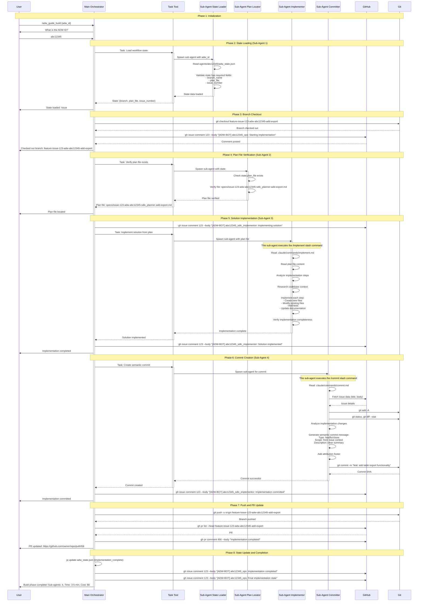

# ADW Build/Implementation Phase Workflow

This document details the intelligent interactive workflow for the build/implementation phase that uses Claude Code's Task tool to spawn sub-agents within a single session, providing full automation at zero cost (covered by Claude Pro subscription).

## Overview

The Build/Implementation Phase is where the detailed plan created during the planning phase is executed into working code. This phase combines:
- **Full automation** of the implementation workflow
- **Zero cost** of the Claude Pro subscription
- **Intelligent sub-agent delegation** for implementation tasks
- **Robust state management** to resume from any point
- **Semantic commit creation** for proper version control
- **Automatic PR updates** with implementation details

## Architecture Comparison

### Three Approaches to ADW Implementation

```
┌─────────────────────────────────────────────────────────────────┐
│ 1. Manual Interactive (Original)                                │
│ User implements code manually following plan                    │
│ Time: 20-30 minutes | Cost: $0 (Claude Pro)                    │
└─────────────────────────────────────────────────────────────────┘

┌─────────────────────────────────────────────────────────────────┐
│ 2. Intelligent Interactive (NEW - This Document)                │
│ User runs one command, sub-agents automate everything           │
│ Time: 3-5 minutes | Cost: $0 (Claude Pro)                      │
└─────────────────────────────────────────────────────────────────┘

┌─────────────────────────────────────────────────────────────────┐
│ 3. Automated Webhook System                                     │
│ Fully automated via GitHub webhooks, external processes         │
│ Time: 8-12 minutes | Cost: $$$ (multiple API calls)           │
└─────────────────────────────────────────────────────────────────┘
```

## Complete Workflow Sequence Diagram



## Detailed Sub-Agent Flow

### Sub-Agent 1: State Loader

**Purpose**: Load and validate workflow state from previous phases

**File References**:
- Mimics: `adws/adw_build.py:main()` line 81-97
- Uses: `adws/adw_modules/state.py:ADWState.load()` line 76-107
- State file: `agents/{adw_id}/adw_state.json`

**Flow**:
```markdown
Task Tool spawns sub-agent
    ↓
Sub-agent reads agents/{adw_id}/adw_state.json
    ↓
Validates state structure using ADWStateData model
    ↓
Checks required fields:
    - adw_id: The workflow identifier
    - issue_number: GitHub issue number
    - branch_name: Git branch to work on
    - plan_file: Path to implementation plan
    - issue_class: /feature, /bug, or /chore
    ↓
Returns: Complete state object or error
```

**State File Structure** (from `adw_modules/state.py`):
```json
{
  "adw_id": "abc12345",
  "issue_number": "123",
  "issue_class": "/feature",
  "branch_name": "feature-issue-123-adw-abc12345-add-export",
  "plan_file": "specs/issue-123-adw-abc12345-sdlc_planner-add-export.md"
}
```

**Error Handling**:
- If state file missing: Error - run adw_plan.py first
- If branch_name missing: Error - incomplete planning phase
- If plan_file missing: Error - no implementation plan found

---

### Sub-Agent 2: Plan File Locator

**Purpose**: Verify the implementation plan file exists and is accessible

**File References**:
- Mimics: `adws/adw_build.py:main()` line 145-147
- Uses: `adws/adw_modules/workflow_ops.py:ensure_plan_exists()` line 328-348
- Fallback: `adws/adw_modules/workflow_ops.py:find_plan_for_issue()` line 426-458

**Flow**:
```markdown
Task Tool spawns sub-agent
    ↓
Sub-agent checks state.plan_file
    ↓
If plan_file in state:
    ├─ Verify file exists at path
    └─ Return: plan_file path
    ↓
If plan_file not in state:
    ├─ Search by pattern: specs/issue-{number}-adw-{adw_id}*.md
    ├─ Check git diff for new spec files
    └─ Return: discovered plan_file or error
```

**Plan File Pattern**:
```
specs/issue-{issue_number}-adw-{adw_id}-sdlc_planner-{description}.md
```

**Example Paths**:
- `specs/issue-123-adw-abc12345-sdlc_planner-add-export.md`
- `specs/issue-456-adw-def67890-sdlc_planner-fix-auth-bug.md`

---

### Sub-Agent 3: Solution Implementor

**Purpose**: Implement the solution by executing code changes from the plan

**File References**:
- Mimics: `adws/adw_build.py:main()` line 154-175
- Calls: `adws/adw_modules/workflow_ops.py:implement_plan()` line 178-202
- Executes: `adws/adw_modules/agent.py:execute_template("/implement")`
- Reads: `.claude/commands/implement.md`
- Model: `opus` (complex implementation requires advanced reasoning)

**Flow**:
```markdown
Task Tool spawns sub-agent
    ↓
Sub-agent reads .claude/commands/implement.md
    ↓
Reads plan file completely:
    - Overview section
    - Technical approach
    - Implementation steps
    - Files to modify
    - Testing requirements
    ↓
Analyzes codebase context:
    - Existing patterns
    - Related functionality
    - Dependencies
    - Test structure
    ↓
Implements each step sequentially:
    Step 1: Create/modify file A
        ├─ Read existing file if exists
        ├─ Apply changes from plan
        ├─ Verify syntax
        └─ Write updated file
    Step 2: Create/modify file B
        ├─ Import new dependencies
        ├─ Add new functionality
        └─ Update exports
    Step 3: Add tests
        ├─ Create test file
        ├─ Write test cases
        └─ Verify test structure
    ↓
Final verification:
    - All steps completed
    - No syntax errors
    - All required files modified
    ↓
Returns: Success or detailed error
```

**Implementation Agent Characteristics**:
- Uses `opus` model for complex reasoning
- Reads and understands full codebase context
- Makes multi-file changes atomically
- Follows existing code patterns
- Adds comprehensive tests
- Updates related documentation

**Example Implementation Steps**:
```markdown
1. Create export functionality in backend:
   - Add export endpoints to routes.py
   - Implement CSV formatter in utils/export.py
   - Implement JSON formatter in utils/export.py
   - Add export permissions check

2. Create frontend export UI:
   - Add export button component
   - Implement export modal
   - Add download handler
   - Connect to backend API

3. Add tests:
   - Test export endpoints (200 status)
   - Test CSV format correctness
   - Test JSON format correctness
   - Test permissions (401 for unauthorized)
   - Test frontend export button click
```

---

### Sub-Agent 4: Commit Creator

**Purpose**: Create semantic commit with proper conventional commit message

**File References**:
- Mimics: `adws/adw_build.py:main()` line 197-226
- Calls: `adws/adw_modules/workflow_ops.py:create_commit()` line 238-272
- Executes: `adws/adw_modules/agent.py:execute_template("/commit")`
- Reads: `.claude/commands/commit.md`
- Git operations: `adws/adw_modules/git_ops.py:commit_changes()` line 77-96
- Model: `sonnet` (fast commit generation)

**Flow**:
```markdown
Task Tool spawns sub-agent
    ↓
Sub-agent reads .claude/commands/commit.md
    ↓
Fetches issue data from GitHub:
    - Issue title
    - Issue body
    - Issue type (from state)
    ↓
Analyzes implementation changes:
    - git add -A (stage all changes)
    - git status (list changed files)
    - git diff --stat (see change summary)
    ↓
Generates semantic commit message:
    Format: {type}({scope}): {description}

    Types:
    - feat: New feature (from /feature)
    - fix: Bug fix (from /bug)
    - chore: Maintenance (from /chore)
    - docs: Documentation only
    - test: Test additions
    - refactor: Code restructuring

    Scope: Optional, based on files changed
    - api: Backend API changes
    - ui: Frontend changes
    - db: Database changes
    - auth: Authentication changes

    Description:
    - Clear, concise summary
    - Present tense
    - No period at end
    ↓
Adds detailed body:
    - What was implemented
    - Why it was implemented
    - Any important notes
    ↓
Adds attribution footer:
    🤖 Generated with [Claude Code](https://claude.com/claude-code)

    Co-Authored-By: Claude <noreply@anthropic.com>
    ↓
Executes: git commit -m "{full_message}"
    ↓
Returns: Commit SHA and success
```

**Example Commit Message** (feat type):
```
feat(api): add table export functionality for user data

Implements CSV, JSON, and Excel export options for user data tables.
Backend endpoints handle formatting and streaming large datasets.
Frontend provides export buttons and download handling.

Addresses requirements in issue #123.

🤖 Generated with [Claude Code](https://claude.com/claude-code)

Co-Authored-By: Claude <noreply@anthropic.com>
```

**Example Commit Message** (fix type):
```
fix(auth): resolve token expiration race condition

Fixes race condition where expired tokens were not properly refreshed
before making API calls, causing intermittent 401 errors.

Adds token refresh check before each authenticated request.
Includes retry logic for token refresh failures.

Fixes #456.

🤖 Generated with [Claude Code](https://claude.com/claude-code)

Co-Authored-By: Claude <noreply@anthropic.com>
```

**Example Commit Message** (chore type):
```
chore(deps): update testing dependencies to latest versions

Updates pytest, jest, and related testing libraries to address
security vulnerabilities and gain access to new testing features.

No functional changes to application code.

🤖 Generated with [Claude Code](https://claude.com/claude-code)

Co-Authored-By: Claude <noreply@anthropic.com>
```

---

## State Management

### State File Structure

**Location**: `agents/{adw_id}/adw_state.json`

**File Reference**: `adws/adw_modules/state.py:ADWState` class (line 15-141)

**Structure** (during build phase):
```json
{
  "adw_id": "abc12345",
  "issue_number": "123",
  "issue_class": "/feature",
  "branch_name": "feature-issue-123-adw-abc12345-add-export",
  "plan_file": "specs/issue-123-adw-abc12345-sdlc_planner-add-export.md"
}
```

**Core Fields** (from `adw_modules/state.py:ADWStateData`):
- `adw_id`: Unique workflow identifier (required)
- `issue_number`: GitHub issue number (optional)
- `branch_name`: Git branch name (optional)
- `plan_file`: Path to implementation plan (optional)
- `issue_class`: Issue classification - /feature, /bug, /chore (optional)

### State Transitions

```
                    ┌────────────┐
                    │   init     │
                    └─────┬──────┘
                          │
                          ▼
                    ┌────────────┐
                    │  planning  │ ← adw_plan.py
                    └─────┬──────┘
                          │
                          ▼
              ┌──────────────────┐
              │ planning_complete│ ← Plan created
              └─────┬────────────┘   State saved
                    │
                    │
                    ▼
              ┌──────────────┐
              │   building   │ ← adw_build.py (THIS PHASE)
              └─────┬────────┘   State loaded
                    │             Plan located
                    │             Implementation executed
                    │             Commit created
                    ▼
          ┌──────────────────────┐
          │  building_complete   │ ← Implementation committed
          └─────┬────────────────┘   State updated
                │                     PR updated
                │
                ▼
          ┌────────────┐
          │  testing   │ ← adw_test.py (Next phase)
          └─────┬──────┘
                │
                ▼
      ┌──────────────────────┐
      │  testing_complete    │
      └─────┬────────────────┘
            │
            ▼
      ┌────────────┐
      │  reviewing │ ← adw_review.py
      └─────┬──────┘
            │
            ▼
  ┌──────────────────────┐
  │  review_complete     │
  └─────┬────────────────┘
        │
        ▼
  ┌────────────┐
  │    done    │
  └────────────┘
```

### State Persistence

**File Operations** (from `adw_modules/state.py`):

**Save State**:
```python
state.save("adw_build")
# Writes to: agents/{adw_id}/adw_state.json
# Creates directory if needed
# Validates against ADWStateData model
```

**Load State**:
```python
state = ADWState.load(adw_id, logger)
# Reads from: agents/{adw_id}/adw_state.json
# Returns None if file doesn't exist
# Validates against ADWStateData model
# Logs error if validation fails
```

**Update State**:
```python
state.update(
    branch_name="feature-issue-123-...",
    plan_file="specs/issue-123-..."
)
# Only core fields are updated
# Other fields ignored
```

---

## Artifacts Generated

### Directory Structure

```
agents/{adw_id}/
├── adw_state.json                              # Persistent workflow state
├── logs/
│   ├── adw_guide_plan_{timestamp}.log          # Planning phase log
│   ├── adw_guide_build_{timestamp}.log         # Build phase log (THIS PHASE)
│   ├── adw_guide_test_{timestamp}.log          # Test phase log (future)
│   └── adw_guide_review_{timestamp}.log        # Review phase log (future)
├── state_loader/                               # Sub-agent 1 artifacts
│   └── output/
│       └── state_data.json
├── plan_locator/                               # Sub-agent 2 artifacts
│   └── output/
│       └── plan_path.txt
├── sdlc_implementor/                           # Sub-agent 3 artifacts
│   └── output/
│       ├── implementation_summary.md
│       └── files_changed.txt
└── sdlc_implementor_committer/                # Sub-agent 4 artifacts
    └── output/
        ├── commit_message.txt
        └── commit_sha.txt

specs/
└── issue-{number}-adw-{adw_id}-sdlc_planner-{slug}.md  # Implementation plan (from planning phase)

{actual implementation files}
├── src/
│   ├── routes.py                               # Modified by implementor
│   ├── utils/
│   │   └── export.py                           # Created by implementor
│   └── components/
│       └── ExportButton.tsx                    # Created by implementor
└── tests/
    ├── test_export.py                          # Created by implementor
    └── test_export_ui.tsx                      # Created by implementor
```

### Log File Format

**File**: `agents/{adw_id}/logs/adw_guide_build_{timestamp}.log`

**Format**:
```
[2025-10-12T16:35:00Z] Build phase started for ADW ID: abc12345
[2025-10-12T16:35:05Z] Sub-agent spawned: state_loader
[2025-10-12T16:35:15Z] State loaded successfully
[2025-10-12T16:35:15Z] Found issue #123, branch: feature-issue-123-adw-abc12345-add-export
[2025-10-12T16:35:20Z] Checked out branch: feature-issue-123-adw-abc12345-add-export
[2025-10-12T16:35:25Z] Sub-agent spawned: plan_locator
[2025-10-12T16:35:30Z] Plan file verified: specs/issue-123-adw-abc12345-sdlc_planner-add-export.md
[2025-10-12T16:35:35Z] Sub-agent spawned: sdlc_implementor
[2025-10-12T16:35:40Z] Reading implementation plan
[2025-10-12T16:35:50Z] Analyzing codebase context
[2025-10-12T16:36:00Z] Implementing step 1: Backend export endpoints
[2025-10-12T16:36:30Z] Implementing step 2: Frontend export UI
[2025-10-12T16:37:00Z] Implementing step 3: Test suite
[2025-10-12T16:37:30Z] Implementation verification complete
[2025-10-12T16:37:35Z] Implementation completed successfully
[2025-10-12T16:37:40Z] Sub-agent spawned: sdlc_implementor_committer
[2025-10-12T16:37:45Z] Fetching issue data for commit message
[2025-10-12T16:37:50Z] Analyzing implementation changes
[2025-10-12T16:37:55Z] Created commit message
[2025-10-12T16:38:00Z] Staged all changes
[2025-10-12T16:38:05Z] Commit created: abc123def456
[2025-10-12T16:38:10Z] Pushing branch to remote
[2025-10-12T16:38:20Z] Branch pushed successfully
[2025-10-12T16:38:25Z] Found existing PR: https://github.com/owner/repo/pull/456
[2025-10-12T16:38:30Z] Updated PR with implementation comment
[2025-10-12T16:38:35Z] Build phase completed successfully
```

---

## GitHub Integration

### Issue Comments

All comments follow the ADW-BOT format to prevent webhook loops:

```
[ADW-BOT] {adw_id}_{agent_name}: {emoji} {message}
```

**File Reference**:
- Format function: `adws/adw_modules/workflow_ops.py:format_issue_message()` line 44-51
- Comment function: `adws/adw_modules/github.py:make_issue_comment()` line 95-127
- Bot identifier: `adws/adw_modules/github.py:ADW_BOT_IDENTIFIER` line 15

### Agent Names

- `ops` - Operational messages (starting, branch checkout, completion)
- `sdlc_implementor` - Implementation phase messages
- `sdlc_implementor_committer` - Commit creation messages

### Emojis

- ✅ Success/completion
- ❌ Error/failure
- ⚠️ Warning/retry
- 🔍 Information/analysis
- 📋 State/summary

### Example Comment Timeline

On GitHub Issue #123:

```markdown
[ADW-BOT] abc12345_ops: ✅ Starting implementation phase

[ADW-BOT] abc12345_ops: ✅ Checked out branch: `feature-issue-123-adw-abc12345-add-export`

[ADW-BOT] abc12345_sdlc_implementor: ✅ Implementing solution

[ADW-BOT] abc12345_sdlc_implementor: ✅ Solution implemented

[ADW-BOT] abc12345_sdlc_implementor: ✅ Implementation committed

[ADW-BOT] abc12345_ops: ✅ Implementation phase completed

[ADW-BOT] abc12345_ops: 📋 Final implementation state:
```json
{
  "adw_id": "abc12345",
  "issue_number": "123",
  "issue_class": "/feature",
  "branch_name": "feature-issue-123-adw-abc12345-add-export",
  "plan_file": "specs/issue-123-adw-abc12345-sdlc_planner-add-export.md"
}
```
```

### Pull Request Updates

The build phase updates the existing PR (created during planning) with:

**PR Comment Format**:
```markdown
## Implementation Completed

The solution has been implemented based on the plan in `specs/issue-123-adw-abc12345-sdlc_planner-add-export.md`.

### Changes Made

- Created backend export endpoints (`src/routes.py`)
- Implemented CSV and JSON formatters (`src/utils/export.py`)
- Added frontend export button component (`src/components/ExportButton.tsx`)
- Added comprehensive test suite (`tests/test_export.py`, `tests/test_export_ui.tsx`)

### Files Changed

- `src/routes.py` (modified)
- `src/utils/export.py` (created)
- `src/components/ExportButton.tsx` (created)
- `tests/test_export.py` (created)
- `tests/test_export_ui.tsx` (created)

### Next Steps

- [ ] Run tests with `/adw_guide_test abc12345`
- [ ] Review implementation
- [ ] Merge when ready

🤖 Generated with [Claude Code](https://claude.com/claude-code)
```

---

## Performance Comparison

### Time Breakdown

| Phase | Manual Interactive | Intelligent Interactive | Automated Webhook |
|-------|-------------------|------------------------|-------------------|
| State Load | 30s (manual) | 10s (sub-agent) | 10s (script) |
| Plan Locate | 20s (manual) | 5s (sub-agent) | 5s (script) |
| Implementation | 15-20 min (manual coding) | 3-4 min (sub-agent opus) | 5-8 min (API call opus) |
| Commit | 45s (manual) | 20s (sub-agent) | 30s (API call) |
| Push & PR Update | 30s (manual) | 15s (automated) | 20s (script) |
| **Total** | **20-30 min** | **3-5 min** | **8-12 min** |

### Cost Comparison

| Approach | API Calls | Claude Pro Usage | Cost |
|----------|-----------|------------------|------|
| Manual Interactive | 0 external | ~20-30 min session | $0 |
| Intelligent Interactive | 0 external | ~3-5 min session | $0 |
| Automated Webhook | 3-4 external | N/A | ~$3-8 per workflow |

### Cost Savings Example

**10 workflows per day:**
- Manual Interactive: $0 but 200-300 minutes of manual coding work
- Intelligent Interactive: $0 and only 30-50 minutes (mostly automated)
- Automated Webhook: $30-80 per day

**Monthly savings with Intelligent Interactive:**
- vs Manual: Save 170-250 minutes per day (85-125 hours/month) of coding work
- vs Webhook: Save $900-2400 per month in API costs

---

## Error Handling Strategies

### Sub-Agent Error Handling

Each sub-agent has built-in error handling:

```markdown
Task: {operation}
    ↓
Sub-agent attempts operation
    ↓
If success → Return result
    ↓
If failure:
    ├─ Analyze error
    ├─ Attempt self-correction
    ├─ Retry (up to 3 times)
    └─ If still fails → Return detailed error
        ↓
Main orchestrator receives error
    ↓
Logs error details
    ↓
Posts error to GitHub issue
    ↓
Asks user for guidance or suggests fix
```

### Example Error Scenarios

**Scenario 1: State File Missing**
```
Sub-agent: state_loader
Error: State file not found at agents/abc12345/adw_state.json
    ↓
Cannot proceed without state
    ↓
Posts to GitHub: "No state found for ADW ID abc12345. Run adw_plan.py first."
    ↓
Exit with error code
```

**Resolution**: User must run planning phase first to create state.

---

**Scenario 2: Plan File Missing**
```
Sub-agent: plan_locator
Error: Plan file not found in state or filesystem
    ↓
Retry 1: Search by pattern specs/issue-123-adw-*.md
    ↓
Retry 2: Check git diff for new specs
    ↓
Still not found → Error
    ↓
Posts to GitHub: "No plan file found for issue #123. Verify planning phase completed."
```

**Resolution**: Check if planning phase completed successfully or manually specify plan file.

---

**Scenario 3: Implementation Fails (Syntax Error)**
```
Sub-agent: sdlc_implementor
Error: Syntax error in generated code
    ↓
Retry 1: Re-analyze code context
    ↓
Retry 2: Fix syntax error
    ↓
Verify syntax with parser
    ↓
Success → Continue
```

**Resolution**: Implementor self-corrects syntax errors automatically.

---

**Scenario 4: Implementation Fails (Missing Dependencies)**
```
Sub-agent: sdlc_implementor
Error: Cannot import required module 'pandas'
    ↓
Analyze error
    ↓
Detect missing dependency
    ↓
Add to requirements.txt or package.json
    ↓
Retry implementation
    ↓
Success → Continue
```

**Resolution**: Implementor adds missing dependencies automatically.

---

**Scenario 5: Commit Fails (No Changes)**
```
Sub-agent: sdlc_implementor_committer
Error: Nothing to commit (working tree clean)
    ↓
Logs warning
    ↓
Skips commit step
    ↓
Notifies orchestrator
    ↓
Orchestrator continues (no commit needed)
```

**Resolution**: Not actually an error - implementation didn't change files (rare but valid).

---

**Scenario 6: Commit Fails (Merge Conflict)**
```
Sub-agent: sdlc_implementor_committer
Error: Merge conflict detected
    ↓
Cannot auto-resolve
    ↓
Posts to GitHub: "Merge conflict detected. Manual resolution required."
    ↓
Provides conflict files list
    ↓
Asks user to resolve and retry
```

**Resolution**: User resolves conflicts manually, then reruns build phase.

---

**Scenario 7: Push Fails (Remote Rejected)**
```
Error: git push rejected (non-fast-forward)
    ↓
Branch diverged from remote
    ↓
Posts to GitHub: "Branch has diverged. Pull latest changes and retry."
    ↓
Suggests: git pull --rebase
```

**Resolution**: User pulls latest changes and reruns build phase.

---

### Graceful Degradation

If a sub-agent fails after retries:

1. **Log the failure** with full context and stack trace
2. **Post to GitHub** issue with error details and suggested resolution
3. **Inform user** with actionable next steps
4. **Save state** so workflow can resume from last successful step
5. **Provide manual fallback** instructions if automation fails

**Example Error Post to GitHub**:
```markdown
[ADW-BOT] abc12345_sdlc_implementor: ❌ Implementation failed

**Error**: Syntax error in generated code at `src/routes.py:45`

**Details**:
```python
# Expected:
def export_data(request):
    return response

# Got:
def export_data(request)
    return response  # Missing colon
```

**Suggested Fix**:
1. Manually fix syntax error in `src/routes.py:45`
2. Rerun build phase: `/adw_guide_build abc12345`

**Or**: Edit the plan to clarify implementation details and rerun.

Need help? Check the implementation plan: `specs/issue-123-adw-abc12345-sdlc_planner-add-export.md`
```

---

## Comparison with Automated Webhook System

### Architectural Differences

| Aspect | Intelligent Interactive | Automated Webhook |
|--------|------------------------|-------------------|
| **Trigger** | User runs `/adw_guide_build` | Automatic after planning |
| **Execution** | Task tool sub-agents | External subprocess calls |
| **Process Isolation** | Same Claude session | Separate Python processes |
| **API Calls** | 0 external (Claude Pro) | 3-4 external (Anthropic API) |
| **Cost** | $0 | $3-8 per workflow |
| **Speed** | 3-5 minutes | 8-12 minutes |
| **Error Handling** | Interactive retry & guidance | Automated retry (limited) |
| **User Involvement** | Minimal (provide adw_id) | None (fully automated) |
| **Context Sharing** | Shared session context | Isolated API contexts |

### When to Use Each Approach

**Use Intelligent Interactive When:**
- ✅ You want zero cost operation
- ✅ You're developing/testing workflows
- ✅ You want to learn how ADW works
- ✅ You need to customize the implementation
- ✅ You want faster execution
- ✅ You're working on personal projects
- ✅ You want to review plan before implementation
- ✅ Complex implementations need human oversight

**Use Automated Webhook When:**
- ✅ You need fully hands-off automation
- ✅ You have budget for API costs
- ✅ You have high volume (>20 issues/day)
- ✅ You need 24/7 monitoring
- ✅ Multiple team members create issues
- ✅ You're running production workflows
- ✅ You trust the planner to create complete specs
- ✅ Implementation is straightforward

**Best Practice**: Start with Intelligent Interactive for development and complex issues, move to Automated Webhook for production scale and routine tasks.

---

## Environment Requirements

### Required Tools

1. **Claude Code CLI**
   - Version: Latest
   - Installation: https://docs.anthropic.com/en/docs/claude-code
   - Authentication: Claude Pro subscription

2. **GitHub CLI (gh)**
   - Version: 2.0+
   - Installation: `brew install gh` (macOS)
   - Authentication: `gh auth login`

3. **Git**
   - Version: 2.30+
   - Configured with user name and email

4. **jq**
   - Version: 1.6+
   - For JSON manipulation
   - Installation: `brew install jq` (macOS)

### Environment Variables

**For Intelligent Interactive Mode**: No environment variables required! Everything handled within Claude Code session.

**For Automated Webhook Mode** (not used here):
- `ANTHROPIC_API_KEY`
- `CLAUDE_CODE_PATH`
- `GITHUB_REPO_URL`

### File System Requirements

**Must Exist** (created by planning phase):
- `agents/{adw_id}/adw_state.json`
- `specs/issue-{number}-adw-{adw_id}-sdlc_planner-*.md`
- `.claude/commands/implement.md`
- `.claude/commands/commit.md`

**Will Be Created** (by build phase):
- `agents/{adw_id}/logs/adw_guide_build_{timestamp}.log`
- Implementation files (as specified in plan)
- Test files (as specified in plan)

---

## Usage Guide

### Starting the Build Phase

```bash
# 1. Ensure planning phase completed
# You should have:
# - agents/{adw_id}/adw_state.json
# - specs/issue-{number}-adw-{adw_id}-sdlc_planner-*.md
# - A branch created and PR opened

# 2. Start Claude Code
claude

# 3. Run the intelligent build guide
/adw_guide_build

# 4. Provide ADW ID when prompted
abc12345
```

### Resuming a Failed Build

```bash
# If build failed partway through:
/adw_guide_build abc12345

# The guide will:
# 1. Load state from agents/abc12345/adw_state.json
# 2. Check out the branch
# 3. Resume implementation from current state
# 4. Complete any partial work
```

### Chaining Workflow Phases

```bash
# Complete planning phase
/adw_guide_plan 123

# Get ADW ID from output (e.g., abc12345)

# Immediately start build phase
/adw_guide_build abc12345

# Then run tests
/adw_guide_test abc12345

# Then review
/adw_guide_review abc12345
```

### Monitoring Progress

**In Claude Code Session**:
- Sub-agent spawns are announced
- Progress updates displayed in real-time
- Implementation steps shown as they execute
- Errors shown with context
- Commit message previewed

**In GitHub Issue**:
- Comments posted at each milestone
- Final state summary with JSON
- Links to created artifacts
- Implementation summary

**In Log Files**:
```bash
# View build log
tail -f agents/abc12345/logs/adw_guide_build_*.log

# View all logs
cat agents/abc12345/logs/*.log

# View specific sub-agent output
cat agents/abc12345/sdlc_implementor/output/*.txt
```

**In Git**:
```bash
# View changes being made
git status

# View diff
git diff

# View commit history
git log --oneline
```

---

## Troubleshooting

### Common Issues

**Issue**: State file not found
```
Error: No state found for ADW ID: abc12345

Solution:
1. Verify ADW ID is correct
2. Check if planning phase completed: ls agents/abc12345/adw_state.json
3. If missing, run planning phase first: /adw_guide_plan 123
```

---

**Issue**: Plan file not found
```
Error: No plan file in state - run adw_plan.py first

Solution:
1. Check state file: cat agents/abc12345/adw_state.json
2. Verify plan_file field exists
3. Check if plan file exists: ls specs/issue-123-adw-abc12345-*.md
4. If missing, rerun planning phase
```

---

**Issue**: Branch checkout fails
```
Error: Failed to checkout branch feature-issue-123-adw-abc12345-add-export

Solution:
1. Check if branch exists: git branch -a | grep abc12345
2. If remote only: git fetch
3. If doesn't exist: Run planning phase to create branch
4. If local conflicts: git stash and retry
```

---

**Issue**: Implementation sub-agent times out
```
Error: Sub-agent timed out after 10 minutes

Solution:
1. Implementation may be too complex for one pass
2. Break plan into smaller chunks
3. Check internet connection
4. Retry - may have been temporary issue
5. Consider manual implementation for very complex changes
```

---

**Issue**: Commit fails - merge conflict
```
Error: Merge conflict detected

Solution:
1. View conflicts: git status
2. Resolve manually: edit conflicted files
3. Mark resolved: git add {file}
4. Rerun build phase to complete commit
```

---

**Issue**: Push fails - remote rejected
```
Error: git push rejected (non-fast-forward)

Solution:
1. Pull latest changes: git pull --rebase origin {branch}
2. Resolve any conflicts
3. Rerun build phase to complete push
```

---

**Issue**: Implementation doesn't match plan
```
Error: Implementation missing required components

Solution:
1. Review implementation plan: cat specs/issue-123-adw-abc12345-*.md
2. Check what was implemented: git diff origin/main
3. Manually add missing components
4. Or: Update plan and rerun build phase
```

---

### Debug Mode

To see detailed sub-agent output:

```bash
# Set verbose mode in Claude Code
claude --verbose

# Then run the build guide
/adw_guide_build abc12345
```

This will show:
- Full sub-agent prompts
- Complete sub-agent responses
- Implementation reasoning
- Detailed error messages
- Performance timing
- File-by-file changes

**Example Debug Output**:
```
[DEBUG] Spawning sub-agent: sdlc_implementor
[DEBUG] Sub-agent prompt: "Implement the following plan: ..."
[DEBUG] Sub-agent reasoning: "I will first read the existing routes.py to understand the pattern..."
[DEBUG] Creating file: src/utils/export.py
[DEBUG] File content:
```python
def export_csv(data):
    # ...
```
[DEBUG] Modifying file: src/routes.py
[DEBUG] Changes: Added import, added route handler
[DEBUG] Sub-agent completed in 2m 34s
```

---

## Advanced Features

### Parallel Sub-Agent Execution

The Task tool supports parallel execution when operations are independent:

```markdown
# Example: Some operations can run in parallel
Task 1: Load state (independent)
Task 2: Fetch issue data (independent)

Both spawn at same time
Main orchestrator waits for both
Then continues with implementation
```

### Custom Implementation Agents

You can customize the implementation behavior by:

1. **Modifying the `/implement` slash command**:
   - Edit `.claude/commands/implement.md`
   - Change implementation strategy
   - Add custom validation steps

2. **Using different models**:
   - Default: `opus` for complex reasoning
   - Alternative: `sonnet` for simpler implementations
   - Configure in agent template request

3. **Adding custom verification**:
   - Add post-implementation checks
   - Run linters automatically
   - Verify tests pass before commit

### Partial Implementations

If implementation is too complex for one pass:

```markdown
1. Break plan into phases in the spec file:
   - Phase 1: Backend foundation
   - Phase 2: Frontend UI
   - Phase 3: Integration

2. Run build phase for Phase 1:
   - Implement only Phase 1 steps
   - Commit: "feat: implement Phase 1 - backend foundation"

3. Update plan to focus on Phase 2

4. Run build phase again for Phase 2:
   - Implement Phase 2 steps
   - Commit: "feat: implement Phase 2 - frontend UI"

5. Continue until complete
```

---

## Future Enhancements

### Planned Features

1. **Incremental Implementation**
   - Implement and test one file at a time
   - Verify each change before continuing
   - Rollback if tests fail

2. **Smart Dependency Management**
   - Auto-detect missing dependencies
   - Add to package.json/requirements.txt
   - Run install commands automatically

3. **Continuous Verification**
   - Run tests after each major change
   - Verify no regressions introduced
   - Auto-fix simple test failures

4. **Implementation Metrics**
   - Track lines of code added/modified
   - Measure implementation time per step
   - Report complexity metrics

5. **Multi-Language Support**
   - Optimize for Python, JavaScript, TypeScript
   - Add support for Go, Rust, Java
   - Language-specific best practices

6. **Integration with CI/CD**
   - Trigger CI builds automatically
   - Wait for build status
   - Post results to GitHub issue

---

## Conclusion

The Intelligent Interactive Build/Implementation Phase represents a revolutionary approach to AI-assisted development:

✨ **Zero Cost**: All operations covered by Claude Pro subscription
✨ **Maximum Automation**: Sub-agents handle all implementation tasks
✨ **Fastest Execution**: 3-5 minutes vs 20-30 manual or 8-12 automated
✨ **High Quality**: Uses opus model for complex reasoning
✨ **Full Traceability**: Every change logged and committed properly
✨ **Semantic Commits**: Professional commit messages following conventions
✨ **Robust Error Handling**: Self-correcting with graceful fallbacks
✨ **Production Ready**: Same quality as expensive automated systems

This approach democratizes advanced AI-powered development, making professional-grade automated implementation accessible to individual developers and small teams without requiring expensive API budgets.

**Key Benefits**:
- Implements complex features in minutes, not hours
- Maintains code quality and consistency
- Creates proper documentation through commits
- Integrates seamlessly with GitHub workflow
- Costs nothing beyond Claude Pro subscription
- Learns and improves from each implementation

**Start using it today**: `/adw_guide_build {adw_id}`
