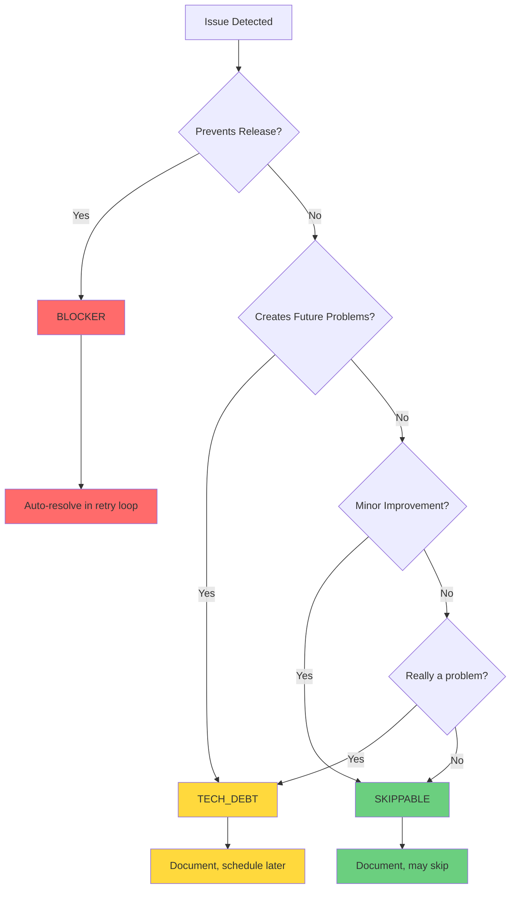
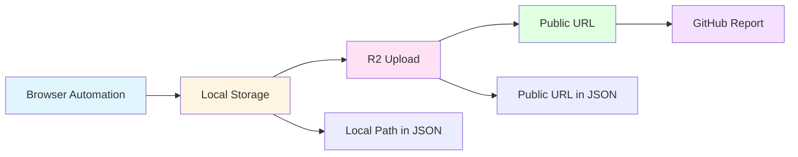

# ADW Review Phase Workflow

This document details the intelligent review phase that verifies implementation against specification, captures screenshots, categorizes issues by severity, and automatically resolves blocking issues.

## Overview

The Review Phase is a comprehensive quality assurance workflow that combines:
- **Automated spec verification** - Compares implementation against requirements
- **Visual validation** - Captures screenshots of critical functionality paths
- **Browser automation** - Uses Playwright MCP integration for UI testing
- **Screenshot management** - Uploads to Cloudflare R2 for permanent storage
- **Issue categorization** - Classifies issues as blockers, tech debt, or skippable
- **Automated resolution** - Auto-fixes blocking issues through patch workflow
- **Iterative retry** - Re-reviews after resolution up to 3 attempts

## Architecture Comparison

### Review Approaches

```
┌─────────────────────────────────────────────────────────────────┐
│ 1. Manual Review                                                 │
│ Developer manually reviews code against spec                     │
│ Time: 30-60 minutes | Cost: $0 | Coverage: Variable             │
└─────────────────────────────────────────────────────────────────┘

┌─────────────────────────────────────────────────────────────────┐
│ 2. Automated ADW Review (This Document)                          │
│ AI agent reviews spec, captures screenshots, categorizes issues  │
│ Time: 3-5 minutes | Cost: ~$1 (Opus review + screenshot upload) │
│ Coverage: Comprehensive with visual proof                        │
└─────────────────────────────────────────────────────────────────┘

┌─────────────────────────────────────────────────────────────────┐
│ 3. Automated with Auto-Resolution                                │
│ Same as above + automatic blocker resolution with retry          │
│ Time: 5-15 minutes | Cost: ~$2-5 (depends on issue count)       │
│ Coverage: Comprehensive with self-healing                        │
└─────────────────────────────────────────────────────────────────┘
```

## Complete Review Workflow Sequence Diagram

```mermaid
sequenceDiagram
    participant U as User
    participant M as Main Orchestrator
    participant S1 as Sub-Agent State Loader
    participant S2 as Sub-Agent Spec Locator
    participant S3 as Sub-Agent Reviewer
    participant S4 as Sub-Agent Screenshot Capturer
    participant S5 as Sub-Agent R2 Uploader
    participant S6 as Sub-Agent Issue Categorizer
    participant S7 as Sub-Agent Blocker Resolver
    participant S8 as Sub-Agent Review Reporter
    participant GH as GitHub
    participant Git as Git
    participant R2 as Cloudflare R2
    participant Browser as Browser via MCP

    Note over U,Browser: Phase 1: Initialization & State Loading
    U->>M: uv run adw_review.py {issue_number} {adw_id}
    activate M
    M->>S1: Load existing ADW state
    activate S1
    S1->>S1: Read agents/{adw_id}/adw_state.json
    S1->>S1: Validate state:<br/>- adw_id<br/>- issue_number<br/>- branch_name<br/>- plan_file
    S1-->>M: State loaded
    deactivate S1
    M->>GH: Post comment: Starting review phase
    M->>Git: git checkout {branch_name}
    Git-->>M: Branch checked out

    Note over M,Browser: Phase 2: Spec File Location
    M->>S2: Find specification file
    activate S2
    S2->>S2: Check state.plan_file
    alt Spec in state
        S2-->>M: spec/issue-{num}-adw-{id}-*.md
    else Search git diff
        S2->>Git: git diff origin/main --name-only
        Git-->>S2: Changed files list
        S2->>S2: Filter spec/*.md files
        S2-->>M: Found spec file
    else Pattern matching
        S2->>S2: glob spec/issue-{num}-adw-{id}*.md
        S2-->>M: Matched spec file
    end
    deactivate S2
    M->>GH: Post comment: Using spec file {path}

    Note over M,Browser: Phase 3: Implementation Review (Attempt 1)
    M->>S3: Review implementation against spec
    activate S3
    S3->>Git: git branch (check context)
    S3->>Git: git diff origin/main
    Git-->>S3: Implementation changes
    S3->>S3: Read spec file
    S3->>S3: Analyze requirements vs implementation

    Note over S3,Browser: Screenshot Capture Phase
    S3->>Browser: Execute prepare_app.md
    Browser->>Browser: Reset database (scripts/reset_db.sh)
    Browser->>Browser: Start app (nohup sh scripts/start.sh)
    S3->>Browser: Navigate to application
    S3->>S4: Capture critical functionality screenshots
    activate S4
    S4->>Browser: Navigate to feature entry point
    Browser-->>S4: Page loaded
    S4->>Browser: Take screenshot (01_initial_state.png)
    S4->>Browser: Interact with feature
    Browser-->>S4: Action completed
    S4->>Browser: Take screenshot (02_action_result.png)
    S4->>Browser: Verify edge cases
    Browser-->>S4: Validation complete
    S4->>Browser: Take screenshot (03_edge_case.png)
    S4->>S4: Save to agents/{adw_id}/{agent}/review_img/
    S4-->>S3: Screenshots: [01_*.png, 02_*.png, 03_*.png]
    deactivate S4

    S3->>S6: Categorize any issues found
    activate S6
    S6->>S6: Analyze each issue:<br/>- Impact on user experience<br/>- Blocks release?<br/>- Technical debt?
    S6->>S6: Assign severity:<br/>- blocker: Harms UX/doesn't work<br/>- tech_debt: Future problem<br/>- skippable: Minor/nice-to-have
    S6-->>S3: Categorized issues
    deactivate S6

    S3->>S3: Generate ReviewResult:<br/>{<br/>  success: bool,<br/>  review_summary: str,<br/>  review_issues: [...],<br/>  screenshots: [...]<br/>}
    S3-->>M: ReviewResult JSON
    deactivate S3

    Note over M,R2: Phase 4: Screenshot Upload to R2
    M->>S5: Upload screenshots to R2
    activate S5
    S5->>S5: Initialize R2 client:<br/>- Account ID<br/>- Access keys<br/>- Bucket name<br/>- Public domain
    loop For each screenshot
        S5->>S5: Generate object key:<br/>adw/{adw_id}/review/{filename}
        S5->>R2: Upload file to bucket
        R2-->>S5: Upload successful
        S5->>S5: Generate public URL:<br/>https://{domain}/{key}
        S5->>S5: Map local path → public URL
    end
    S5->>S5: Populate ReviewResult:<br/>- screenshot_urls<br/>- issue.screenshot_url
    S5-->>M: URL mapping complete
    deactivate S5
    M->>M: Update state with screenshot URLs

    Note over M,GH: Phase 5: Report Review Results
    M->>S8: Format review report
    activate S8
    S8->>S8: Group issues by severity
    S8->>S8: Format markdown report:<br/>- Summary<br/>- Blocker issues<br/>- Tech debt issues<br/>- Skippable issues<br/>- Screenshots with URLs<br/>- JSON payload
    S8-->>M: Formatted report
    deactivate S8
    M->>GH: Post review results comment
    GH-->>M: Comment posted

    Note over M,Browser: Phase 6: Blocker Resolution (if needed)
    alt Review has blockers AND not skip_resolution
        M->>GH: Post: Starting resolution for {N} blockers
        loop For each blocker issue
            M->>S7: Resolve blocker issue
            activate S7
            S7->>S7: Format review change request:<br/>{description}<br/>{resolution}
            S7->>S7: Include issue screenshot

            Note over S7: Create Patch Plan
            S7->>S7: Call /patch slash command:<br/>- adw_id<br/>- change_request<br/>- spec_path<br/>- agent: review_patch_planner_{iter}_{num}<br/>- screenshots
            S7->>S7: Generate patch plan:<br/>specs/patch/issue-{num}-adw-{id}-review-patch-{iter}-{num}.md
            S7-->>M: Patch plan path
            M->>GH: Post: Created patch plan

            Note over S7: Implement Patch
            S7->>S7: Call /implement on patch plan
            S7->>S7: Execute implementation changes
            S7->>S7: Verify changes
            alt Implementation success
                S7-->>M: Implementation successful
                M->>GH: Post: Resolved issue #{num}
            else Implementation failed
                S7-->>M: Implementation failed
                M->>GH: Post: Failed to resolve issue #{num}
            end
            deactivate S7
        end

        Note over M,Git: Commit Resolution Changes
        M->>M: create_commit(review_patch_implementor, issue, command)
        M->>Git: git add . && git commit
        Git-->>M: Commit created
        M->>GH: Post: Resolution changes committed

        Note over M,Browser: Phase 7: Re-Review (Attempt 2)
        M->>GH: Post: Re-running review (attempt 2/3)
        M->>S3: Review implementation again
        Note over S3,R2: Repeat Phases 3-5
        M->>M: Check if blockers remain

        alt Still has blockers AND attempts < 3
            M->>GH: Post: Preparing for retry
            Note over M,Browser: Phase 8: Retry Resolution (Attempt 3)
            Note over M,R2: Repeat Phases 6-7
        else No blockers OR max attempts reached
            M->>M: Exit retry loop
        end
    else No blockers OR skip_resolution flag
        M->>GH: Post: Review complete (no blockers)
    end

    Note over M,Git: Phase 9: Final Review Commit
    M->>M: Fetch issue data
    M->>M: create_commit(reviewer, issue, command)
    M->>Git: git add . && git commit -m "review: {message}"
    Git-->>M: Review committed
    M->>GH: Post: Review committed

    M->>Git: git push origin {branch_name}
    Git-->>M: Branch pushed
    M->>GH: Update PR with review results
    GH-->>M: PR updated

    Note over M,GH: Phase 10: Completion
    M->>M: Save final state to adw_state.json
    M->>M: Output state to stdout
    M->>GH: Post: Review phase completed
    M->>U: Review complete!<br/>Exit code: 0 (if no blockers) or 1 (if blockers remain)
    deactivate M
```



## Detailed Sub-Agent Flows

### Sub-Agent 1: State Loader

**Purpose**: Load and validate existing ADW workflow state

**File References**:
- Implementation: `adws/adw_review.py` lines 432-448
- State class: `adws/adw_modules/state.py:ADWState`

**Flow**:
```markdown
Main orchestrator spawns state loader
    ↓
Load agents/{adw_id}/adw_state.json
    ↓
Validate required fields:
    - adw_id
    - issue_number
    - branch_name
    - plan_file (optional but recommended)
    ↓
If state exists:
    ├─ Return loaded state
    └─ Post GitHub comment with state
    ↓
If state missing:
    ├─ Log error
    ├─ Exit with error code 1
    └─ User must run adw_plan.py first
```

**State Structure**:
```json
{
  "adw_id": "57ee23f4",
  "issue_number": "10",
  "issue_class": "/feature",
  "branch_name": "feature-issue-10-adw-57ee23f4-animate-query-transitions",
  "current_phase": "building_complete",
  "plan_file": "specs/issue-10-adw-57ee23f4-sdlc_planner-animate-query.md",
  "pr_url": "https://github.com/owner/repo/pull/456",
  "mode": "automated",
  "created_at": "2025-10-12T14:30:00Z",
  "updated_at": "2025-10-12T15:45:00Z"
}
```

---

### Sub-Agent 2: Spec File Locator

**Purpose**: Find the implementation specification file

**File References**:
- Implementation: `adws/adw_modules/workflow_ops.py:find_spec_file()` lines 537-584

**Flow**:
```markdown
Main orchestrator spawns spec locator
    ↓
Strategy 1: Check state file
    ├─ Read state.plan_file
    └─ Verify file exists
    ↓
If found → Return spec file path
    ↓
Strategy 2: Search git diff
    ├─ Run: git diff origin/main --name-only
    ├─ Filter files: spec/*.md
    └─ Select first match
    ↓
If found → Return spec file path
    ↓
Strategy 3: Pattern matching
    ├─ Extract issue number from branch name
    ├─ Get adw_id from state
    ├─ glob pattern: spec/issue-{num}-adw-{id}*.md
    └─ Select first match
    ↓
If found → Return spec file path
    ↓
If not found → Return None (error)
```

**Example Spec File Path**:
```
specs/issue-10-adw-57ee23f4-sdlc_planner-animate-query-transitions.md
```

---

### Sub-Agent 3: Implementation Reviewer

**Purpose**: Review implementation against specification with visual validation

**File References**:
- Orchestrator: `adws/adw_review.py:run_review()` lines 90-144
- Command template: `.claude/commands/review.md`
- Agent module: `adws/adw_modules/agent.py:execute_template()`
- Model: `opus` (requires advanced reasoning for spec analysis)

**Flow**:
```markdown
Main orchestrator spawns reviewer
    ↓
Reviewer reads review command template
    ↓
Execute git operations:
    ├─ git branch (check context)
    └─ git diff origin/main (see all changes)
    ↓
Read specification file
    ↓
Analyze requirements vs implementation:
    ├─ Feature completeness
    ├─ Requirement alignment
    ├─ Edge case handling
    └─ Error handling
    ↓
If UI validation possible:
    ├─ Execute prepare_app.md
    │   ├─ Reset database
    │   └─ Start application
    ├─ Spawn Screenshot Capturer
    └─ Navigate critical paths
    ↓
For each discrepancy found:
    ├─ Spawn Issue Categorizer
    ├─ Document issue details
    ├─ Suggest resolution
    └─ Take screenshot if visual
    ↓
Generate ReviewResult JSON:
    ├─ success: bool
    ├─ review_summary: str
    ├─ review_issues: [...]
    └─ screenshots: [...]
    ↓
Return ReviewResult to orchestrator
```

**Review Criteria**:
1. **Completeness**: All spec requirements implemented
2. **Correctness**: Implementation matches spec behavior
3. **Edge Cases**: Proper handling of error conditions
4. **User Experience**: UI matches spec descriptions
5. **Performance**: No obvious performance issues
6. **Security**: Proper validation and sanitization

---

### Sub-Agent 4: Screenshot Capturer

**Purpose**: Capture visual proof of implementation and issues

**File References**:
- Template: `.claude/commands/review.md` lines 18-35
- Browser automation: Playwright MCP integration
- Storage location: `agents/{adw_id}/{agent_name}/review_img/`

**Flow**:
```markdown
Reviewer spawns screenshot capturer
    ↓
Read e2e test files (as navigation guide only):
    └─ .claude/commands/e2e/test_*.md
    ↓
Create review_img directory:
    └─ agents/{adw_id}/{agent_name}/review_img/
    ↓
Navigate to application entry point
    ↓
For each critical functionality path:
    ├─ Navigate to feature
    ├─ Capture initial state (01_feature_initial.png)
    ├─ Perform key action
    ├─ Capture result state (02_feature_result.png)
    ├─ Test edge case
    └─ Capture edge case (03_feature_edge_case.png)
    ↓
For each issue found:
    ├─ Navigate to issue location
    ├─ Capture issue screenshot
    └─ Save with descriptive name
    ↓
Copy all screenshots to review_img directory
    ↓
Use absolute paths in ReviewResult
    ↓
Return screenshot paths to reviewer
```

**Screenshot Guidelines**:
- **Focus on critical paths only** (1-5 screenshots total)
- **Descriptive naming**: `01_descriptive_name.png`
- **Absolute paths**: `/opt/asw/projects/personal/tac/tac-6/agents/abc123/reviewer/review_img/01_*.png`
- **Issue screenshots**: Separate screenshot per issue
- **Quality over quantity**: Show what matters

**Browser Automation**:
```markdown
Via Playwright MCP:
    ├─ mcp__playwright__browser_navigate
    ├─ mcp__playwright__browser_snapshot
    ├─ mcp__playwright__browser_click
    ├─ mcp__playwright__browser_type
    ├─ mcp__playwright__browser_take_screenshot
    └─ mcp__playwright__browser_wait_for
```

---

### Sub-Agent 5: Screenshot Uploader

**Purpose**: Upload screenshots to Cloudflare R2 for permanent public access

**File References**:
- Implementation: `adws/adw_modules/r2_uploader.py:R2Uploader`
- Orchestrator: `adws/adw_review.py:upload_and_map_screenshots()` lines 263-322
- Cloud provider: Cloudflare R2 (S3-compatible)

**Flow**:
```markdown
Main orchestrator spawns uploader
    ↓
Initialize R2 client:
    ├─ CLOUDFLARE_ACCOUNT_ID
    ├─ CLOUDFLARE_R2_ACCESS_KEY_ID
    ├─ CLOUDFLARE_R2_SECRET_ACCESS_KEY
    ├─ CLOUDFLARE_R2_BUCKET_NAME
    └─ CLOUDFLARE_R2_PUBLIC_DOMAIN
    ↓
If credentials missing:
    ├─ Log: "R2 upload disabled"
    └─ Return original paths (graceful degradation)
    ↓
Collect all screenshot paths:
    ├─ ReviewResult.screenshots
    └─ ReviewIssue.screenshot_path for each issue
    ↓
For each screenshot:
    ├─ Convert relative path to absolute
    ├─ Verify file exists
    ├─ Generate object key: adw/{adw_id}/review/{filename}
    ├─ Upload to R2 bucket via boto3
    ├─ Generate public URL: https://{domain}/{key}
    └─ Map local_path → public_url
    ↓
Populate URL fields:
    ├─ ReviewResult.screenshot_urls (index-aligned)
    └─ ReviewIssue.screenshot_url
    ↓
Save screenshot URLs to state:
    └─ state.update(review_screenshots=[...])
    ↓
Return URL mapping to orchestrator
```

**R2 Configuration**:
```bash
# Required environment variables
CLOUDFLARE_ACCOUNT_ID=abc123def456
CLOUDFLARE_R2_ACCESS_KEY_ID=key123
CLOUDFLARE_R2_SECRET_ACCESS_KEY=secret456
CLOUDFLARE_R2_BUCKET_NAME=tac-public-imgs
CLOUDFLARE_R2_PUBLIC_DOMAIN=tac-public-imgs.iddagents.com
```

**Upload Pattern**:
```
Local Path:
/opt/asw/projects/personal/tac/tac-6/agents/abc123/reviewer/review_img/01_feature.png

R2 Object Key:
adw/abc123/review/01_feature.png

Public URL:
https://tac-public-imgs.iddagents.com/adw/abc123/review/01_feature.png
```

**Benefits of R2**:
- ✅ **Permanent storage**: Screenshots survive local cleanup
- ✅ **Public access**: Direct image URLs in GitHub issues/PRs
- ✅ **S3-compatible**: Uses standard boto3 library
- ✅ **Cost-effective**: Cloudflare R2 has no egress fees
- ✅ **Fast CDN**: Global content delivery network
- ✅ **Graceful degradation**: Works without R2 (uses local paths)

---

### Sub-Agent 6: Issue Categorizer

**Purpose**: Categorize review issues by severity and impact

**File References**:
- Template guidance: `.claude/commands/review.md` lines 36-41
- Data types: `adws/adw_modules/data_types.py:ReviewIssue` lines 206-215

**Flow**:
```markdown
Reviewer spawns categorizer for each issue
    ↓
Analyze issue impact:
    ├─ Does it break functionality?
    ├─ Does it harm user experience?
    ├─ Does it violate spec requirements?
    ├─ Does it create future problems?
    └─ Is it a nice-to-have improvement?
    ↓
Apply severity guidelines:
    ├─ blocker: Blocks release
    ├─ tech_debt: Works but creates future debt
    └─ skippable: Minor issue, non-critical
    ↓
Document issue:
    ├─ review_issue_number: sequential ID
    ├─ screenshot_path: visual proof
    ├─ issue_description: what's wrong
    ├─ issue_resolution: how to fix
    └─ issue_severity: classification
    ↓
Return categorized issue
```

**Severity Guidelines**:

| Severity | Description | Examples | Action |
|----------|-------------|----------|--------|
| **blocker** | Blocks release, harms UX, doesn't work as specified | - Feature doesn't work<br/>- Spec requirement missing<br/>- Data corruption<br/>- Security vulnerability<br/>- Critical UI broken | Auto-resolve in retry loop |
| **tech_debt** | Works but creates future problems | - Code duplication<br/>- Missing tests<br/>- Poor error handling<br/>- Hard-coded values<br/>- Performance concerns | Document, schedule later |
| **skippable** | Minor issue, nice-to-have | - UI polish<br/>- Better wording<br/>- Extra validation<br/>- Accessibility improvements | Document, may skip |

**Decision Tree**:
```
Does the issue prevent release?
├─ YES → blocker
└─ NO ↓
    Will it cause problems later?
    ├─ YES → tech_debt
    └─ NO → skippable
```

---

### Sub-Agent 7: Blocker Resolver

**Purpose**: Automatically fix blocking issues through patch workflow

**File References**:
- Implementation: `adws/adw_review.py:resolve_review_issues()` lines 147-260
- Patch creation: `adws/adw_modules/workflow_ops.py:create_and_implement_patch()` lines 587-654
- Model: `opus` (complex problem-solving)

**Flow**:
```markdown
Main orchestrator spawns resolver (if blockers exist)
    ↓
Filter to blocker issues only
    ↓
Post GitHub comment: Resolving {N} blockers
    ↓
For each blocker issue (iteration={attempt}, issue_num):
    ├─ Post: Creating patch plan for issue #{num}
    ├─ Format change request:
    │   ├─ Issue description
    │   ├─ Suggested resolution
    │   └─ Include screenshot if available
    ├─ Generate unique agent names:
    │   ├─ Planner: review_patch_planner_{iter}_{num}
    │   └─ Implementor: review_patch_implementor_{iter}_{num}
    ├─ Call create_and_implement_patch():
    │   ├─ Execute /patch slash command
    │   ├─ Generate patch plan in specs/patch/
    │   ├─ Post: Created patch plan
    │   ├─ Execute /implement slash command
    │   ├─ Apply code changes
    │   └─ Verify implementation
    ├─ Check result:
    │   ├─ If success:
    │   │   ├─ Increment resolved_count
    │   │   └─ Post: Successfully resolved issue #{num}
    │   └─ If failure:
    │       ├─ Increment failed_count
    │       └─ Post: Failed to implement patch
    └─ Continue to next issue
    ↓
Return (resolved_count, failed_count)
    ↓
If resolved_count > 0:
    ├─ Post: Resolution complete ({resolved}/{total})
    ├─ Create commit with changes
    ├─ Post: Resolution changes committed
    └─ Continue to re-review (next iteration)
    ↓
If resolved_count == 0:
    ├─ Post: Resolution failed
    └─ Exit retry loop
```

**Patch Workflow**:
```
/patch slash command
    ↓
Input:
    ├─ adw_id
    ├─ review_change_request
    ├─ spec_path (optional)
    ├─ agent_name_planner
    └─ issue_screenshots (optional)
    ↓
Output:
    └─ specs/patch/issue-{num}-adw-{id}-review-patch-{iter}-{num}.md
    ↓
/implement slash command
    ↓
Input:
    ├─ patch_plan_file
    ├─ adw_id
    └─ agent_name_implementor
    ↓
Output:
    ├─ Code changes applied
    └─ Success/failure response
```

**Retry Logic**:
```markdown
Attempt 1: Initial review
    ├─ Find blockers
    └─ Resolve blockers
    ↓
Attempt 2: Re-review
    ├─ Find remaining blockers
    └─ Resolve blockers
    ↓
Attempt 3: Final re-review
    ├─ Find remaining blockers
    └─ Resolve blockers
    ↓
If blockers remain after attempt 3:
    └─ Exit with warning (max attempts reached)
```

**Skip Resolution Mode**:
```bash
# Skip automatic resolution (review only)
uv run adw_review.py {issue_number} {adw_id} --skip-resolution
```

---

### Sub-Agent 8: Review Reporter

**Purpose**: Format and post detailed review report to GitHub

**File References**:
- Implementation: `adws/adw_review.py:format_review_comment()` lines 324-408
- Posting: `adws/adw_modules/github.py:make_issue_comment()`

**Flow**:
```markdown
Main orchestrator spawns reporter
    ↓
Receive ReviewResult with URLs populated
    ↓
Generate report structure:
    ├─ Success banner OR Issues found banner
    ├─ Review summary
    ├─ Screenshots section (if success)
    ├─ Issues grouped by severity:
    │   ├─ Blockers (🚨)
    │   ├─ Tech Debt (⚠️)
    │   └─ Skippable (ℹ️)
    ├─ For each issue:
    │   ├─ Issue number and description
    │   ├─ Suggested resolution
    │   └─ Screenshot (if available)
    └─ JSON payload section
    ↓
Format as markdown
    ↓
Post to GitHub issue via API
    ↓
Return formatted report
```

**Example Success Report**:
```markdown
## ✅ Review Passed

The implementation matches the specification.

### Screenshots


### Review Data

```json
{
  "success": true,
  "review_summary": "The natural language query feature has been implemented...",
  "review_issues": [],
  "screenshots": ["agents/abc123/reviewer/review_img/01_query_interface.png", ...],
  "screenshot_urls": ["https://domain.com/adw/abc123/review/01_query_interface.png", ...]
}
```
```

**Example Failure Report**:
```markdown
## ❌ Review Issues Found

Found 3 issues during review:

### 🚨 Blockers

**Issue #1**: SQL injection vulnerability in query input
- **Resolution**: Add parameterized queries and input sanitization
- **Screenshot**:
  

**Issue #2**: File upload accepts invalid formats
- **Resolution**: Add MIME type validation for CSV/JSON only
- **Screenshot**:
  

### ⚠️ Tech Debt

**Issue #3**: Hard-coded database connection strings
- **Resolution**: Move to environment variables
- **Screenshot**:
  

### Review Data

```json
{
  "success": false,
  "review_summary": "The natural language query feature has critical security issues...",
  "review_issues": [
    {
      "review_issue_number": 1,
      "screenshot_path": "agents/abc123/reviewer/review_img/error_sql_injection.png",
      "screenshot_url": "https://domain.com/adw/abc123/review/error_sql_injection.png",
      "issue_description": "SQL injection vulnerability in query input",
      "issue_resolution": "Add parameterized queries and input sanitization",
      "issue_severity": "blocker"
    },
    ...
  ],
  "screenshots": [...],
  "screenshot_urls": [...]
}
```
```

---

## Review Issue Categorization System

### Categorization Process



### Severity Definitions

#### Blocker
**Criteria**: MUST be fixed before release
- Breaks core functionality
- Violates spec requirements
- Security vulnerability
- Data corruption risk
- Critical UI completely broken
- User cannot complete intended task

**Examples**:
- Feature doesn't work at all
- Missing spec requirement
- SQL injection vulnerability
- Crashes on user input
- Form submission fails
- Authentication bypass

**Action**: Automatically resolved in retry loop (up to 3 attempts)

#### Tech Debt
**Criteria**: Works but creates future maintenance burden
- Code duplication
- Poor architecture
- Missing error handling
- Hard-coded values
- Performance concerns (non-critical)
- Missing tests
- Poor logging

**Examples**:
- Copy-pasted functions
- Hard-coded connection strings
- No input validation
- Synchronous DB calls in loop
- Missing unit tests
- No error logging

**Action**: Document in review report, schedule for future sprint

#### Skippable
**Criteria**: Nice-to-have improvements
- UI polish
- Better wording
- Extra validation
- Accessibility improvements
- Minor UX enhancements
- Code formatting

**Examples**:
- Button could be larger
- Label could be clearer
- Could add loading spinner
- Could improve contrast
- Could add keyboard shortcuts
- Could alphabetize list

**Action**: Document in review report, may or may not address

### Categorization Guidelines

**Think about impact**:
1. **User impact**: How does this affect the end user?
2. **Business impact**: Does this prevent achieving business goals?
3. **Technical impact**: Does this create maintenance burden?
4. **Risk impact**: What's the worst that could happen?

**When in doubt**:
- If user experience is harmed → **blocker**
- If spec requirement not met → **blocker**
- If works now but breaks later → **tech_debt**
- If purely cosmetic → **skippable**

---

## Screenshot Management and Upload Process

### Screenshot Lifecycle



### Storage Locations

#### Local Storage
```
agents/{adw_id}/{agent_name}/review_img/
├── 01_feature_initial.png
├── 02_feature_action.png
├── 03_feature_result.png
├── error_sql_injection.png
└── error_file_validation.png
```

#### R2 Storage
```
Bucket: tac-public-imgs
Path: adw/{adw_id}/review/
├── 01_feature_initial.png
├── 02_feature_action.png
├── 03_feature_result.png
├── error_sql_injection.png
└── error_file_validation.png
```

#### Public URLs
```
https://tac-public-imgs.iddagents.com/adw/{adw_id}/review/01_feature_initial.png
https://tac-public-imgs.iddagents.com/adw/{adw_id}/review/02_feature_action.png
https://tac-public-imgs.iddagents.com/adw/{adw_id}/review/03_feature_result.png
https://tac-public-imgs.iddagents.com/adw/{adw_id}/review/error_sql_injection.png
https://tac-public-imgs.iddagents.com/adw/{adw_id}/review/error_file_validation.png
```

### Upload Process

**R2Uploader Class**:
```python
class R2Uploader:
    def __init__(self, logger):
        # Initialize boto3 S3 client with R2 endpoint
        self.client = boto3.client(
            's3',
            endpoint_url=f'https://{account_id}.r2.cloudflarestorage.com',
            aws_access_key_id=access_key_id,
            aws_secret_access_key=secret_access_key,
            config=Config(signature_version='s3v4'),
            region_name='us-east-1'
        )

    def upload_file(self, file_path, object_key):
        # Upload file to R2 bucket
        self.client.upload_file(file_path, bucket_name, object_key)
        # Generate public URL
        return f"https://{public_domain}/{object_key}"

    def upload_screenshots(self, screenshots, adw_id):
        # Upload multiple screenshots
        url_mapping = {}
        for screenshot_path in screenshots:
            filename = Path(screenshot_path).name
            object_key = f"adw/{adw_id}/review/{filename}"
            public_url = self.upload_file(screenshot_path, object_key)
            url_mapping[screenshot_path] = public_url
        return url_mapping
```

**URL Mapping**:
```python
# Before upload (ReviewResult)
{
  "screenshots": [
    "agents/abc123/reviewer/review_img/01_feature.png",
    "agents/abc123/reviewer/review_img/02_action.png"
  ],
  "screenshot_urls": []  # Empty
}

# After upload (ReviewResult)
{
  "screenshots": [
    "agents/abc123/reviewer/review_img/01_feature.png",  # Preserved
    "agents/abc123/reviewer/review_img/02_action.png"   # Preserved
  ],
  "screenshot_urls": [
    "https://domain.com/adw/abc123/review/01_feature.png",  # Added
    "https://domain.com/adw/abc123/review/02_action.png"   # Added
  ]
}
```

**Graceful Degradation**:
```python
# If R2 credentials missing or upload fails
if not self.enabled or upload_failed:
    # Use original local path as fallback
    url_mapping[local_path] = local_path
    # Review report will show file paths instead of URLs
```

---

## State Management

### State Updates During Review

**State File**: `agents/{adw_id}/adw_state.json`

**Review Phase Updates**:
```json
{
  "adw_id": "abc123",
  "issue_number": "10",
  "branch_name": "feature-issue-10-adw-abc123-query-feature",
  "current_phase": "reviewing",  // Updated during review
  "plan_file": "specs/issue-10-adw-abc123-sdlc_planner-query.md",
  "review_screenshots": [  // Added after upload
    "https://domain.com/adw/abc123/review/01_feature.png",
    "https://domain.com/adw/abc123/review/02_action.png"
  ],
  "updated_at": "2025-10-12T16:45:00Z"  // Updated
}
```

**State Transitions**:
```
building_complete → reviewing → review_complete → documenting
                    ↓ (if blockers)
                    resolving → reviewing (retry) → review_complete
```

---

## Artifacts and Log Formats

### Directory Structure

```
agents/{adw_id}/
├── adw_state.json                                    # Persistent state
├── logs/
│   └── adw_review_{timestamp}.log                    # Review phase log
├── reviewer/                                         # Main review agent
│   ├── review_img/                                   # Screenshot storage
│   │   ├── 01_feature_initial.png
│   │   ├── 02_feature_action.png
│   │   └── error_sql_injection.png
│   └── output/
│       └── review_result.json                        # Structured output
├── review_patch_planner_1_1/                         # Iteration 1, Issue 1 planner
│   └── output/
│       └── patch_plan.md
├── review_patch_implementor_1_1/                     # Iteration 1, Issue 1 implementor
│   └── output/
│       └── implementation_result.json
├── review_patch_planner_1_2/                         # Iteration 1, Issue 2 planner
│   └── output/
│       └── patch_plan.md
└── review_patch_implementor_1_2/                     # Iteration 1, Issue 2 implementor
    └── output/
        └── implementation_result.json

specs/patch/
├── issue-10-adw-abc123-review-patch-1-1.md          # Patch for issue #1, iter 1
└── issue-10-adw-abc123-review-patch-1-2.md          # Patch for issue #2, iter 1
```

### Log File Format

**File**: `agents/{adw_id}/logs/adw_review_{timestamp}.log`

**Format**:
```
[2025-10-12T16:00:00Z] ADW Review starting - ID: abc123, Issue: 10
[2025-10-12T16:00:05Z] Found existing state - starting review
[2025-10-12T16:00:10Z] Checked out branch: feature-issue-10-adw-abc123-query-feature
[2025-10-12T16:00:15Z] Using spec file from state: specs/issue-10-adw-abc123-sdlc_planner-query.md
[2025-10-12T16:00:20Z] Running review against specification
[2025-10-12T16:00:25Z] Review Attempt 1/3
[2025-10-12T16:03:45Z] Review found 2 issues (2 blockers)
[2025-10-12T16:03:50Z] Uploading review screenshots to R2
[2025-10-12T16:04:00Z] Screenshot upload complete - 3 files processed
[2025-10-12T16:04:05Z] Saved 3 screenshot URLs to state for documentation
[2025-10-12T16:04:10Z] Starting resolution workflow
[2025-10-12T16:04:15Z] Found 2 blocker issues to resolve
[2025-10-12T16:04:20Z] === Resolving blocker issue 1/2: Issue #1 ===
[2025-10-12T16:05:30Z] Created patch plan: specs/patch/issue-10-adw-abc123-review-patch-1-1.md
[2025-10-12T16:07:00Z] Successfully resolved issue #1
[2025-10-12T16:07:05Z] === Resolving blocker issue 2/2: Issue #2 ===
[2025-10-12T16:08:15Z] Created patch plan: specs/patch/issue-10-adw-abc123-review-patch-1-2.md
[2025-10-12T16:09:45Z] Successfully resolved issue #2
[2025-10-12T16:09:50Z] Resolution complete: 2 issues resolved, 0 failed
[2025-10-12T16:09:55Z] Committing resolution changes
[2025-10-12T16:10:00Z] Committed resolution: fix: resolve review blockers for query validation
[2025-10-12T16:10:05Z] === Preparing for re-review after resolving 2 issues ===
[2025-10-12T16:10:10Z] Review Attempt 2/3
[2025-10-12T16:12:30Z] Review passed - implementation matches specification (no blocking issues)
[2025-10-12T16:12:35Z] Uploading review screenshots to R2
[2025-10-12T16:12:45Z] Screenshot upload complete - 3 files processed
[2025-10-12T16:12:50Z] Creating review commit
[2025-10-12T16:13:00Z] Committed review: review: verify query feature implementation
[2025-10-12T16:13:10Z] Branch pushed to remote
[2025-10-12T16:13:15Z] Review phase completed successfully
```

### Review Result JSON

**File**: `agents/{adw_id}/reviewer/output/review_result.json`

**Structure**:
```json
{
  "success": false,
  "review_summary": "The natural language query feature has been implemented with drag-and-drop file upload and interactive table display. However, there are critical security issues with SQL injection protection that must be addressed before release. The implementation matches most spec requirements except for input validation.",
  "review_issues": [
    {
      "review_issue_number": 1,
      "screenshot_path": "agents/abc123/reviewer/review_img/error_sql_injection.png",
      "screenshot_url": "https://domain.com/adw/abc123/review/error_sql_injection.png",
      "issue_description": "SQL injection vulnerability in natural language query input field",
      "issue_resolution": "Add parameterized queries and comprehensive input sanitization to prevent SQL injection attacks",
      "issue_severity": "blocker"
    },
    {
      "review_issue_number": 2,
      "screenshot_path": "agents/abc123/reviewer/review_img/error_file_validation.png",
      "screenshot_url": "https://domain.com/adw/abc123/review/error_file_validation.png",
      "issue_description": "File upload accepts any file type instead of CSV/JSON only",
      "issue_resolution": "Add MIME type validation to restrict uploads to text/csv and application/json",
      "issue_severity": "blocker"
    },
    {
      "review_issue_number": 3,
      "screenshot_path": "agents/abc123/reviewer/review_img/tech_debt_hardcoded.png",
      "screenshot_url": "https://domain.com/adw/abc123/review/tech_debt_hardcoded.png",
      "issue_description": "Database connection string is hard-coded in source file",
      "issue_resolution": "Move database credentials to environment variables",
      "issue_severity": "tech_debt"
    }
  ],
  "screenshots": [
    "agents/abc123/reviewer/review_img/01_query_interface.png",
    "agents/abc123/reviewer/review_img/02_file_upload.png",
    "agents/abc123/reviewer/review_img/03_query_results.png"
  ],
  "screenshot_urls": [
    "https://domain.com/adw/abc123/review/01_query_interface.png",
    "https://domain.com/adw/abc123/review/02_file_upload.png",
    "https://domain.com/adw/abc123/review/03_query_results.png"
  ]
}
```

---

## Performance Comparisons

### Time Breakdown

| Phase | Without Auto-Resolution | With Auto-Resolution (1 iter) | With Auto-Resolution (3 iters) |
|-------|------------------------|-------------------------------|--------------------------------|
| State Load | 5s | 5s | 5s |
| Spec Location | 10s | 10s | 10s |
| App Preparation | 30s | 30s | 30s |
| Initial Review (Opus) | 120s | 120s | 120s |
| Screenshot Capture | 30s | 30s | 30s |
| R2 Upload | 15s | 15s | 15s |
| Issue Categorization | 10s | 10s | 10s |
| Report Generation | 10s | 10s | 10s |
| **Subtotal (Review Only)** | **230s (3.8 min)** | **230s (3.8 min)** | **230s (3.8 min)** |
| Blocker Resolution | N/A | 180s (2 issues × 90s) | 180s × 3 = 540s |
| Resolution Commit | N/A | 10s | 10s × 3 = 30s |
| Re-Review | N/A | 120s | 120s × 2 = 240s |
| **Total** | **230s (3.8 min)** | **540s (9 min)** | **1040s (17.3 min)** |

### Cost Breakdown

| Operation | Model | Input Tokens | Output Tokens | Cost per Call | Calls | Total Cost |
|-----------|-------|--------------|---------------|---------------|-------|------------|
| Initial Review | Opus | ~10K | ~2K | ~$0.35 | 1 | $0.35 |
| Screenshot Capture | Sonnet (MCP) | ~5K | ~500 | ~$0.03 | 1 | $0.03 |
| R2 Upload | N/A | - | - | ~$0.01 | 1 | $0.01 |
| **Subtotal (Review)** | | | | | | **$0.39** |
| Patch Planning (per issue) | Opus | ~8K | ~1.5K | ~$0.28 | 2 | $0.56 |
| Patch Implementation (per issue) | Opus | ~10K | ~2K | ~$0.35 | 2 | $0.70 |
| Re-Review | Opus | ~10K | ~2K | ~$0.35 | 1 | $0.35 |
| **Subtotal (1 Resolution)** | | | | | | **$1.61** |
| **Total (Review + 1 Resolution)** | | | | | | **$2.00** |
| **Total (Review + 3 Resolutions)** | | | | | | **$4.83** |

*Note: Costs are approximate based on typical token usage. Actual costs may vary.*

### Comparison with Manual Review

| Approach | Time | Cost | Coverage | Reproducibility | Documentation |
|----------|------|------|----------|-----------------|---------------|
| Manual Review | 30-60 min | $0 | Variable | Low | Manual notes |
| ADW Review (no resolution) | 3.8 min | $0.39 | Comprehensive | High | Structured JSON + Screenshots |
| ADW Review (with resolution) | 9-17 min | $2-5 | Comprehensive | High | Structured JSON + Screenshots + Auto-fixed |

### Cost-Benefit Analysis

**10 reviews per day:**
- Manual: 300-600 minutes (5-10 hours), $0, variable quality
- ADW Review: 38-173 minutes (0.6-2.9 hours), $20-50, consistent quality
- **Savings**: 4-7 hours per day, standardized quality, visual proof

**Monthly (20 working days):**
- Manual: 100-200 hours, $0
- ADW Review: 13-58 hours, $400-1000
- **Savings**: 87-142 hours per month, worth $8,700-$14,200 at $100/hr

---

## Usage Guide

### Starting a Review

```bash
# 1. Ensure you're in the project directory
cd /path/to/project

# 2. Run review with ADW ID from planning phase
uv run adw_review.py {issue_number} {adw_id}

# Example
uv run adw_review.py 10 abc12345
```

### Skip Auto-Resolution

```bash
# Review only, don't auto-fix blockers
uv run adw_review.py {issue_number} {adw_id} --skip-resolution

# Example
uv run adw_review.py 10 abc12345 --skip-resolution
```

### Monitoring Progress

**In Terminal**:
```bash
# Watch the review log in real-time
tail -f agents/{adw_id}/logs/adw_review_*.log

# Example
tail -f agents/abc12345/logs/adw_review_20251012_160000.log
```

**In GitHub Issue**:
- Comments posted at each milestone
- Screenshots displayed inline
- Review results with issue categorization
- Resolution progress updates

**Review State**:
```bash
# Check current state
cat agents/{adw_id}/adw_state.json | jq

# Check review results
cat agents/{adw_id}/reviewer/output/review_result.json | jq
```

### Understanding Exit Codes

```bash
# Exit code 0: Review passed (no blockers)
echo $?  # 0

# Exit code 1: Review failed (blockers remain)
echo $?  # 1
```

---

## Troubleshooting

### Common Issues

**Issue**: No state found for ADW ID
```
Error: No state found for ADW ID: abc12345
Run adw_plan.py first to create the state

Solution:
1. Verify ADW ID is correct
2. Run planning phase first: uv run adw_plan.py {issue_number}
3. Use ADW ID from planning output
```

**Issue**: Could not find spec file for review
```
Error: Could not find spec file for review

Solution:
1. Verify plan_file exists in state
2. Check git diff for spec/*.md files
3. Ensure branch name contains issue number
4. Manually specify spec file in state
```

**Issue**: R2 upload disabled
```
Warning: R2 upload disabled - missing required environment variables

Solution:
1. Set Cloudflare R2 credentials in .env:
   CLOUDFLARE_ACCOUNT_ID=...
   CLOUDFLARE_R2_ACCESS_KEY_ID=...
   CLOUDFLARE_R2_SECRET_ACCESS_KEY=...
   CLOUDFLARE_R2_BUCKET_NAME=...
   CLOUDFLARE_R2_PUBLIC_DOMAIN=...
2. Or continue without R2 (uses local paths)
```

**Issue**: Browser automation fails
```
Error: Failed to start browser or navigate

Solution:
1. Check prepare_app.md script execution
2. Verify database reset: sh scripts/reset_db.sh
3. Verify app start: sh scripts/start.sh
4. Check application is running on expected port
5. Review MCP Playwright configuration
```

**Issue**: Blocker resolution fails repeatedly
```
Warning: Reached maximum retry attempts (3) with N blocking issues

Solution:
1. Review the patch plans created in specs/patch/
2. Check implementation logs in review_patch_implementor_*/
3. Manually fix remaining blockers
4. Re-run review to verify fixes
```

**Issue**: Review takes too long
```
Warning: Review taking > 5 minutes

Possible causes:
1. App preparation timeout (database reset)
2. Slow browser automation (network issues)
3. Large diff (many files to review)
4. Complex spec (requires deep analysis)

Solution:
1. Check application logs
2. Verify network connectivity
3. Consider breaking into smaller PRs
4. Use --skip-resolution to speed up
```

---

## Integration with Other Phases

### Workflow Integration

```
Planning → Building → Testing → REVIEW → Documentation → Merge
```

### Chaining Workflows

```bash
# Complete SDLC: Plan + Build + Test + Review + Document
uv run adw_sdlc.py {issue_number}

# Or run phases separately
uv run adw_plan.py {issue_number}
# ... get adw_id ...
uv run adw_build.py {issue_number} {adw_id}
uv run adw_test.py {issue_number} {adw_id}
uv run adw_review.py {issue_number} {adw_id}
uv run adw_document.py {issue_number} {adw_id}
```

### State Handoff

```json
// After review, state includes:
{
  "current_phase": "review_complete",
  "review_screenshots": [
    "https://domain.com/adw/abc123/review/01_feature.png",
    "https://domain.com/adw/abc123/review/02_action.png"
  ]
}

// Documentation phase uses these screenshots
```

---

## Future Enhancements

### Planned Features

1. **Parallel Issue Resolution**
   - Resolve multiple blockers simultaneously
   - Reduce total resolution time
   - Smart dependency detection

2. **Visual Regression Testing**
   - Compare screenshots across commits
   - Detect unintended UI changes
   - Automated visual diffing

3. **Smart Screenshot Selection**
   - AI determines optimal screenshot locations
   - Adaptive to feature complexity
   - Reduced storage requirements

4. **Progressive Resolution**
   - Start with easiest blockers first
   - Build momentum with quick wins
   - Smart ordering algorithm

5. **Review Templates**
   - Customizable review criteria
   - Domain-specific checks (security, accessibility, etc.)
   - Project-specific guidelines

6. **Collaborative Review**
   - Multi-agent review (security + UX + performance)
   - Aggregate results from specialists
   - Comprehensive coverage

---

## Conclusion

The ADW Review Phase represents a comprehensive automated quality assurance system:

✨ **Spec Verification**: Ensures implementation matches requirements
✨ **Visual Validation**: Captures proof of functionality with screenshots
✨ **Smart Categorization**: Distinguishes blockers from nice-to-haves
✨ **Auto-Resolution**: Fixes critical issues automatically
✨ **Cloud Storage**: Permanent screenshot hosting via R2
✨ **Detailed Reporting**: Structured JSON + beautiful GitHub reports
✨ **Iterative Retry**: Up to 3 attempts to resolve blockers
✨ **Cost-Effective**: ~$2-5 per review with auto-resolution

This approach transforms code review from a time-consuming manual process into a fast, consistent, and thorough automated workflow with visual proof and self-healing capabilities.

**Start using it today**: `uv run adw_review.py {issue_number} {adw_id}`
