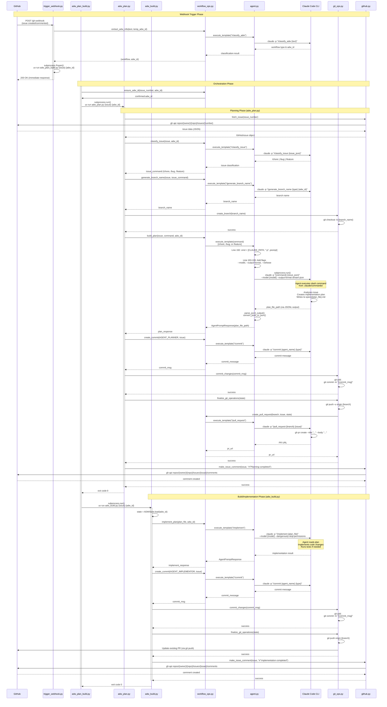

# ADW Workflow Sequence Diagram

This diagram shows the detailed flow of the AI Developer Workflow (ADW) system, including the actual files and functions called at each step.

## Complete ADW Workflow with File Details



## Key Files and Their Roles

### Trigger Layer
- **`adws/adw_triggers/trigger_webhook.py`**: FastAPI webhook server
  - Receives GitHub events
  - Classifies workflow type
  - Launches workflow scripts via `subprocess.Popen`
  - Returns immediate response to GitHub

### Orchestration Layer
- **`adws/adw_plan_build.py`**: Main orchestrator
  - Chains planning and build phases sequentially
  - Uses `subprocess.run()` for synchronous execution
  - Passes state between phases via ADWState

### Workflow Scripts
- **`adws/adw_plan.py`**: Planning phase
  - Fetches issue from GitHub
  - Classifies issue type
  - Generates branch name
  - Creates implementation plan
  - Commits plan and creates PR

- **`adws/adw_build.py`**: Implementation phase
  - Loads existing plan from state
  - Implements the solution
  - Commits implementation
  - Updates PR

### Core Modules
- **`adws/adw_modules/workflow_ops.py`**: Business logic
  - `classify_issue()` - Determines issue type
  - `build_plan()` - Creates implementation plan
  - `implement_plan()` - Executes implementation
  - `generate_branch_name()` - Creates branch name
  - `create_commit()` - Generates commit message
  - `create_pull_request()` - Creates GitHub PR

- **`adws/adw_modules/agent.py`**: Claude Code CLI integration
  - **Line 192**: `cmd = [CLAUDE_PATH, "-p", request.prompt]`
  - **Line 193-199**: Adds CLI flags (`--model`, `--output-format`, `--verbose`)
  - **Line 207-209**: Executes via `subprocess.run(cmd, ...)`
  - `execute_template()` - Executes slash commands
  - `parse_jsonl_output()` - Parses Claude Code output
  - `convert_jsonl_to_json()` - Converts JSONL to JSON

- **`adws/adw_modules/git_ops.py`**: Git operations
  - `create_branch()` - Creates feature branch
  - `commit_changes()` - Commits with message
  - `finalize_git_operations()` - Push and PR creation

- **`adws/adw_modules/github.py`**: GitHub API operations
  - `fetch_issue()` - Gets issue details via `gh api`
  - `make_issue_comment()` - Posts comments via `gh api`
  - Uses GitHub CLI (`gh`) for all API calls

- **`adws/adw_modules/state.py`**: State management
  - `ADWState` class for persistent workflow state
  - Stored in `agents/{adw_id}/adw_state.json`
  - Enables workflow chaining and resumption

### Claude Code CLI
- **Claude Code executable** (configured via `CLAUDE_CODE_PATH`)
  - Executes slash commands from `.claude/commands/`
  - Outputs to JSONL format (`--output-format stream-json`)
  - Returns structured responses with session IDs

## Command Flow Example

### Complete command chain for `adw_plan_build`:

1. **Webhook** → `uv run adw_plan_build.py 123 abc123def`
2. **Plan Build** → `uv run adw_plan.py 123 abc123def`
3. **Plan** → `claude -p "/classify_issue {json}" --model sonnet`
4. **Plan** → `claude -p "/generate_branch_name feature abc123def {json}" --model sonnet`
5. **Plan** → `claude -p "/feature 123 abc123def {json}" --model opus`
6. **Plan** → `claude -p "/commit sdlc_planner feature {json}" --model sonnet`
7. **Plan** → `claude -p "/pull_request {branch} {json} {plan_file}" --model sonnet`
8. **Plan Build** → `uv run adw_build.py 123 abc123def`
9. **Build** → `claude -p "/implement {plan_file}" --model opus`
10. **Build** → `claude -p "/commit sdlc_implementor feature {json}" --model sonnet`

## State Flow

```
ADWState (agents/{adw_id}/adw_state.json)
├── adw_id: "abc123def"
├── issue_number: "123"
├── issue_class: "/feature"
├── branch_name: "feature-issue-123-adw-abc123def-add-animation"
├── plan_file: "specs/issue-123-adw-abc123def-sdlc_planner-add-animation.md"
└── pr_url: "https://github.com/owner/repo/pull/456"
```

## Agent Output Structure

```
agents/{adw_id}/
├── adw_state.json                    # Persistent state
├── sdlc_planner/                     # Planning agent
│   ├── raw_output.jsonl              # JSONL output
│   ├── raw_output.json               # Converted JSON array
│   └── prompts/
│       ├── classify_issue.txt
│       ├── generate_branch_name.txt
│       ├── feature.txt
│       └── commit.txt
├── sdlc_implementor/                 # Implementation agent
│   ├── raw_output.jsonl
│   ├── raw_output.json
│   └── prompts/
│       ├── implement.txt
│       └── commit.txt
└── execution.log                     # Combined execution log
```

## Environment Variables Required

- `GITHUB_REPO_URL`: Repository URL
- `ANTHROPIC_API_KEY`: Anthropic API key for Claude
- `CLAUDE_CODE_PATH`: Path to Claude Code CLI (default: "claude")
- `GITHUB_PAT`: GitHub Personal Access Token (optional if using `gh auth`)

## Notes

- **Immediate Response**: Webhook responds in <10s to meet GitHub timeout
- **Background Execution**: Workflow runs asynchronously via `subprocess.Popen`
- **State Persistence**: ADWState enables workflow chaining and resumption
- **Agent Isolation**: Each agent writes to isolated directory with unique ID
- **Model Selection**: Mapped per slash command (sonnet for fast ops, opus for complex tasks)
- **Output Format**: Claude Code uses `stream-json` for structured parsing
